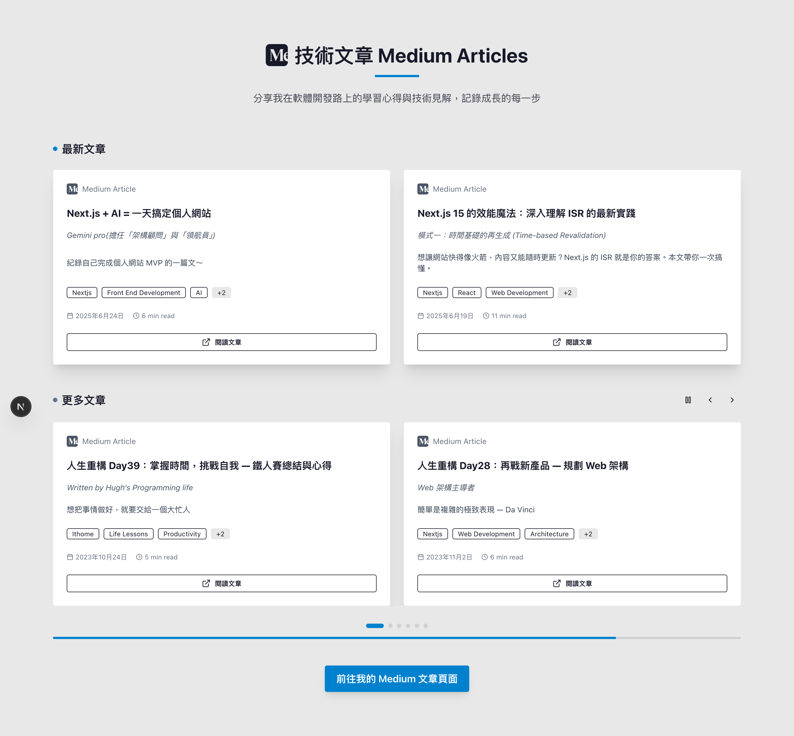

# 🚀 Henry Lee's Personal Website

一個現代化的個人網站，展示專業技能、工作經驗、專案作品，並整合 Medium 文章自動化管理系統。

## 📸 預覽畫面

### 🏠 Hero Section


_展示網站首頁的 Hero Section，包含個人介紹、技術背景描述、關鍵成就數據以及行動按鈕_

### 📝 Medium 文章展示區域



_展示 Medium 文章自動化系統的完整佈局：「最新文章」固定展示最新兩篇，「更多文章」輪播展示其餘文章，包含自動播放控制、指示器和優雅的動畫效果_

## ✨ 主要功能

### 🏠 個人展示

- **響應式設計** - 完美適配各種裝置
- **現代化 UI** - 使用 Tailwind CSS 打造美觀介面
- **動態效果** - 打字機效果、動畫背景等互動元素
- **多頁面導航** - 關於我、專案、部落格頁面

### 📚 技術展示

- **技能矩陣** - 視覺化展示技術棧和熟練度
- **專案作品集** - 展示重要專案與技術細節
- **工作經驗** - 時間軸式展示職涯歷程
- **聯絡方式** - 多種聯絡管道整合

### 📝 Medium 文章自動化系統 ⭐

- **自動抓取** - 一鍵獲取 Medium 文章資訊
- **智能解析** - 自動提取標題、描述、標籤、縮圖
- **技術標籤** - 自動分析並標記真實的 Medium 標籤
- **優雅輪播** - 精選文章固定展示 + 其餘文章自動輪播
- **響應式設計** - 桌面顯示2篇，手機自動調整為1篇

## 🛠️ 技術棧

### Frontend

- **Next.js 14** - React 框架，支援 App Router
- **TypeScript** - 型別安全的 JavaScript
- **Tailwind CSS** - 原子級 CSS 框架
- **React Components** - 模組化組件設計

### Development Tools

- **ESLint** - 程式碼檢查工具
- **PostCSS** - CSS 後處理器
- **pnpm** - 高效能包管理器

### Automation

- **Node.js Scripts** - 文章資料自動化處理
- **Medium API Integration** - 文章內容抓取

## 📦 安裝與啟動

### 前置需求

- Node.js 18+
- pnpm (推薦) 或 npm

### 安裝步驟

```bash
# 克隆專案
git clone <repository-url>
cd my-website

# 安裝依賴
pnpm install

# 啟動開發伺服器
pnpm dev
```

開啟瀏覽器訪問 [http://localhost:3000](http://localhost:3000)

## 🤖 Medium 文章自動化使用指南

### 快速開始

1. **添加文章 URL**

   ```bash
   # 編輯文章連結清單
   vim article-urls.json
   ```

2. **執行自動化腳本**

   ```bash
   # 一鍵抓取並更新所有文章資料
   node scripts/batch-parse-articles.js
   ```

3. **查看結果**
   - 文章資料會自動更新到 `src/data/articleData.ts`
   - 網站重新整理即可看到最新文章

### 詳細說明文檔

📖 **[Medium 文章自動化完整指南](./docs/MEDIUM-ARTICLES-GUIDE.md)**

## 📁 專案結構

```
my-website/
├── 📁 src/
│   ├── 📁 app/                 # Next.js App Router 頁面
│   │   ├── 📁 home/           # 首頁組件
│   │   └── 📁 shared/         # 共用組件
│   ├── 📁 data/               # 資料層
│   │   ├── articleData.ts     # Medium 文章資料 (自動生成)
│   │   ├── projectData.ts     # 專案資料
│   │   └── skillData.tsx      # 技能資料
│   └── 📁 types/              # TypeScript 型別定義
├── 📁 scripts/                # 自動化腳本
│   └── batch-parse-articles.js  # Medium 文章解析腳本
├── 📁 docs/                   # 文檔
│   └── MEDIUM-ARTICLES-GUIDE.md # Medium 功能說明
├── 📁 public/                 # 靜態資源
├── article-urls.json          # Medium 文章 URL 清單
└── package.json              # 專案配置
```

## 🔧 開發指令

```bash
# 開發模式
pnpm dev

# 建置專案
pnpm build

# 啟動正式環境
pnpm start

# 程式碼檢查
pnpm lint

# Medium 文章更新
node scripts/batch-parse-articles.js
```

## 📖 相關文檔

- 📝 **[Medium 文章自動化指南](./docs/MEDIUM-ARTICLES-GUIDE.md)** - 完整的自動化系統使用說明
- 🗂️ **[article-urls.json](./article-urls.json)** - Medium 文章 URL 管理
- 🤖 **[batch-parse-articles.js](./scripts/batch-parse-articles.js)** - 自動化解析腳本
- 📊 **[articleData.ts](./src/data/articleData.ts)** - 文章資料結構 (請勿手動編輯)

## 🌟 特色功能說明

### 🎯 響應式設計

網站完全響應式，在桌面、平板、手機上都有最佳體驗。

### ⚡ 效能優化

- Next.js 15 App Router 架構
- 自動程式碼分割
- 圖片優化
- 字體優化

### 🎨 現代化 UI/UX

- 簡潔優雅的視覺設計
- 流暢的動畫效果
- 直觀的使用者介面
- 深色模式支援 (未來功能)

## 🚀 部署

### Vercel 部署 (推薦)

```bash
# 使用 Vercel CLI
vercel --prod
```

### 其他平台

專案支援任何支援 Next.js 的部署平台，如 Netlify、Railway 等。

## 🤝 貢獻

歡迎提出 Issue 或 Pull Request 來改善這個專案！

## 📄 授權

MIT License - 詳見 [LICENSE](./LICENSE) 文件

---

⭐ **如果這個專案對你有幫助，歡迎給個 Star！**
