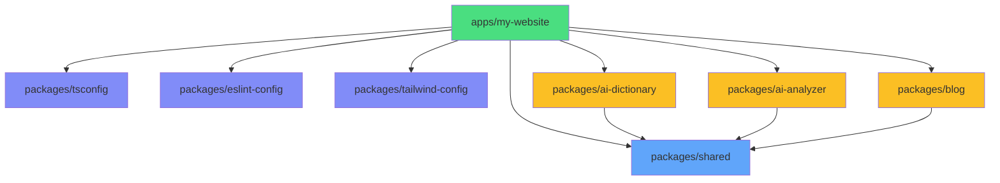
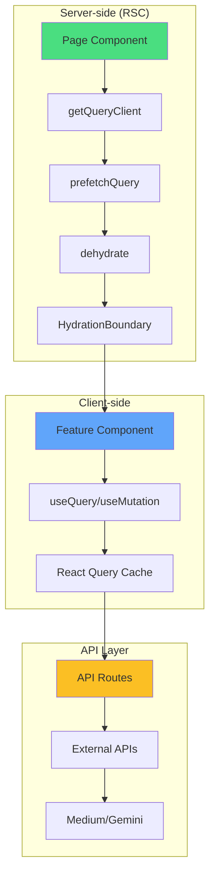
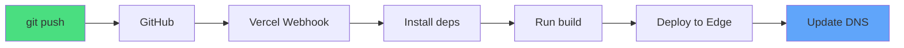
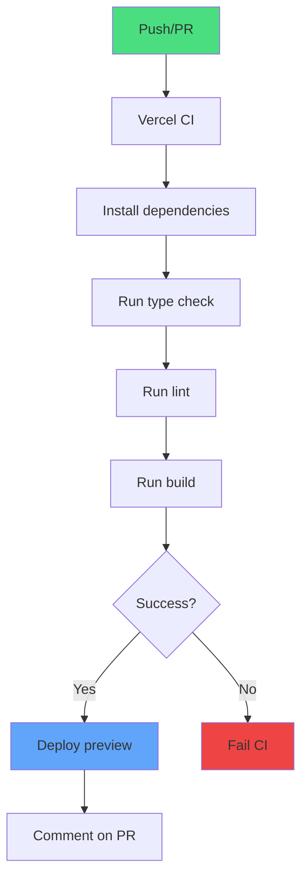
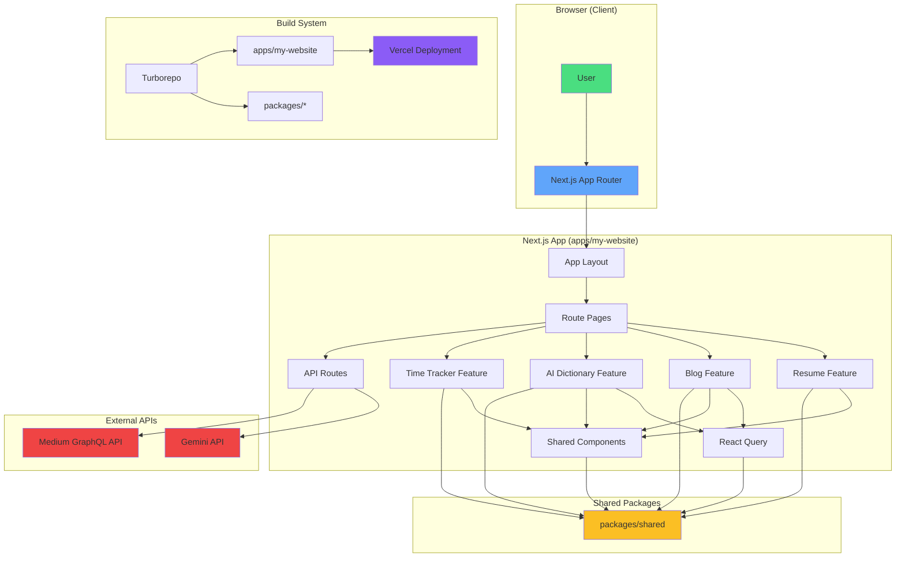
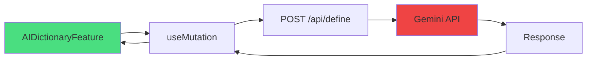
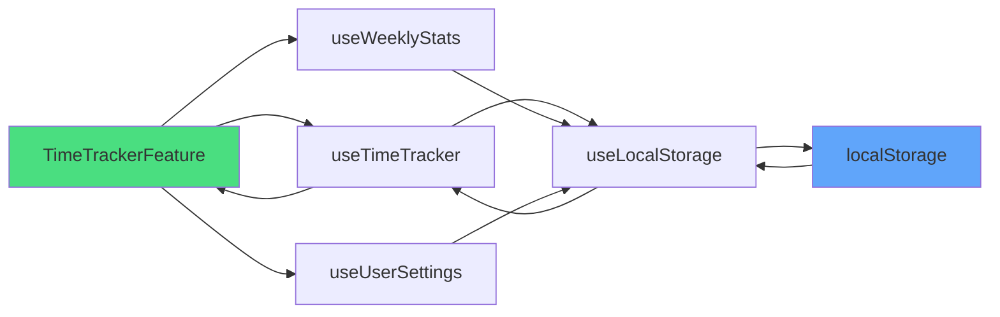

# System Architecture Reference

---

title: System Architecture Reference
type: reference
status: stable
audience: [developer, architect, ai]
tags: [architecture, nextjs, turborepo, monorepo, feature-based]
created: 2025-11-07
updated: 2025-11-07
version: 1.0.0
related:

- explanation/feature-based-architecture.md
- explanation/monorepo-strategy.md
- adr/001-react-query-ssg-pattern.md
- adr/002-agents-md-adoption.md
- explanation/git-hooks-research.md
  ai_context: |
  Complete technical reference for the system architecture including monorepo structure,
  feature-based design, data flow, and deployment architecture. Use this to understand
  the overall system design, technology decisions, and how components interact.

---

## Overview

**What this documents**: The complete system architecture of Henry Lee's personal website (henryleelab.com), a production Next.js 15 monorepo built with TypeScript, Turborepo, and modern React patterns.

**Architecture type**: Feature-based monorepo with clear boundaries, using Next.js App Router, React Server Components, and static site generation.

**Key characteristics**:

- Monorepo managed by Turborepo and pnpm workspaces
- Feature-based architecture with enforced boundaries (ESLint)
- Next.js 15 App Router with RSC (React Server Components)
- Static site generation (SSG) with selective data prefetching
- React Query for server state management
- Vercel deployment with automatic CI/CD

**Project location**: `/Users/henrylee/personal/my-website`

**Production URL**: https://henryleelab.com

---

## Quick Reference

**Most common operations:**

| Operation            | Command                                   | Description                                  |
| -------------------- | ----------------------------------------- | -------------------------------------------- |
| Start development    | `pnpm dev`                                | Launch dev server with Turbo TUI (port 3000) |
| Build for production | `pnpm build`                              | Build all apps with Turborepo caching        |
| Run quality checks   | `pnpm check`                              | Run type check + lint + format (auto-fix)    |
| Sync Medium articles | `pnpm sync:all-articles`                  | Fetch and parse latest Medium articles       |
| Add new feature      | Create in `apps/my-website/src/features/` | Follow feature structure pattern             |

**Project structure quick view:**

```
my-website/
├── apps/
│   └── my-website/          # Main Next.js 15 application
│       ├── src/
│       │   ├── app/         # Next.js App Router (routes)
│       │   ├── features/    # Feature-based modules (isolated)
│       │   ├── components/  # Shared UI components
│       │   ├── lib/         # Core libraries (React Query, logger)
│       │   └── types/       # Global type definitions
│       └── scripts/         # Build-time scripts (Medium sync)
├── packages/
│   ├── shared/              # Shared types, data, utilities
│   ├── tsconfig/            # Shared TypeScript configs
│   └── eslint-config/       # Shared ESLint configs
└── docs/                    # Documentation (ADRs, guides, refs)
```

---

## Technology Stack

### Core Technologies

**Runtime & Framework:**

- **Next.js**: 15.4.7 (App Router, RSC, SSG)
- **React**: 19.0.0 (Server Components, hooks)
- **TypeScript**: 5.9.3 (strict mode)
- **Node.js**: >= 20.x

**Build & Development:**

- **Turborepo**: 2.5.8 (monorepo build orchestration)
- **pnpm**: 9.15.4 (package manager, workspaces)
- **Turbopack**: Built into Next.js 15 (dev mode bundler)
- **ESBuild**: Via Next.js (production builds)

**Styling & UI:**

- **Tailwind CSS**: 4.1.16 (utility-first CSS)
- **DaisyUI**: 5.4.2 (component library)
- **Framer Motion**: 12.23.24 (animations)
- **lucide-react**: 0.552.0 (UI icons)
- **react-icons**: 5.5.0 (brand/company logos)

**State Management & Data:**

- **React Query**: 5.81.2 (server state, caching)
- **date-fns**: 4.1.0 (date manipulation)
- **localStorage**: Native (time-tracker persistence)

**AI Integration:**

- **Google Gemini API**: 2.5 Flash Lite (AI dictionary & analyzer)
- **@google/generative-ai**: 0.24.1 (SDK)

**Logging & Monitoring:**

- **Pino**: 10.1.0 (structured logging)
- **@vercel/analytics**: 1.5.0 (web analytics)
- **@vercel/speed-insights**: 1.2.0 (performance tracking)

**Development Tools:**

- **ESLint**: 9.39.0 (linting, flat config)
- **Prettier**: 3.6.2 (formatting)
- **Husky**: 9.1.7 (git hooks)
- **lint-staged**: 16.1.2 (pre-commit checks)
- **Commitlint**: 20.1.0 (commit message validation)
- **tsx**: 4.20.6 (TypeScript script execution)

**External Services:**

- **Medium API**: GraphQL API (article fetching)
- **Vercel**: Deployment platform
- **Cheerio**: 1.1.2 (HTML parsing for articles)

### Version Requirements

| Technology  | Version Constraint | Reason                                |
| ----------- | ------------------ | ------------------------------------- |
| React Query | >= 5.84.1          | Fixed SSG compatibility bug (ADR-001) |
| Next.js     | 15.x               | App Router, RSC, Turbopack support    |
| React       | 19.x               | Required by Next.js 15                |
| TypeScript  | 5.x                | Strict mode features                  |
| pnpm        | 9.15.4+            | Workspace protocol support            |

---

## Monorepo Structure

### Workspace Organization

**Root configuration:**

```json
{
  "name": "my-website-monorepo",
  "private": true,
  "packageManager": "pnpm@9.15.4",
  "workspaces": ["apps/*", "packages/*"]
}
```

**Workspace topology:**

```
Root (my-website-monorepo)
├── apps/
│   └── my-website (Next.js app)
│       ├── depends on: @packages/shared
│       ├── depends on: @packages/tsconfig
│       ├── depends on: @packages/eslint-config
│       ├── depends on: @packages/tailwind-config
│       ├── depends on: @packages/ai-dictionary
│       ├── depends on: @packages/ai-analyzer
│       └── depends on: @packages/blog
└── packages/
    ├── shared/           # No dependencies (foundation)
    ├── tsconfig/         # No dependencies
    ├── eslint-config/    # No dependencies
    ├── tailwind-config/  # No dependencies
    ├── ai-dictionary/    # depends on: @packages/shared
    ├── ai-analyzer/      # depends on: @packages/shared
    └── blog/             # depends on: @packages/shared
```

### Apps

#### apps/my-website

**Purpose**: Main Next.js 15 application serving henryleelab.com

**Technology**: Next.js 15 (App Router), React 19, TypeScript

**Structure**:

```
apps/my-website/
├── src/
│   ├── app/              # Next.js App Router (file-based routing)
│   │   ├── layout.tsx    # Root layout (providers, fonts)
│   │   ├── page.tsx      # Homepage (resume feature)
│   │   ├── blog/         # Blog route
│   │   ├── about/        # About route
│   │   ├── ai-dictionary/  # AI Dictionary route
│   │   ├── ai-analyzer/    # AI Analyzer route
│   │   ├── time-tracker/   # Time Tracker route
│   │   ├── api/          # API routes
│   │   │   ├── define/       # POST - AI word analysis
│   │   │   ├── ai-analyzer/  # POST - AI analysis
│   │   │   └── medium-articles/ # GET - Cached articles
│   │   └── not-found.tsx # 404 page
│   ├── features/         # Feature modules (self-contained)
│   │   ├── resume/       # Homepage/resume feature
│   │   ├── blog/         # Blog listing feature
│   │   ├── ai-dictionary/  # AI dictionary feature
│   │   ├── ai-analyzer/    # AI analyzer feature
│   │   ├── time-tracker/   # Time tracking feature
│   │   ├── about/        # About page feature
│   │   └── not-found/    # 404 feature
│   ├── components/       # Shared UI components
│   │   └── shared/       # Importable across features
│   ├── lib/              # Core libraries
│   │   ├── query-client.ts  # React Query setup
│   │   ├── logger/          # Pino logger config
│   │   └── medium/          # Medium API integration
│   ├── types/            # Global type definitions
│   ├── constants/        # Global constants
│   ├── utils/            # Global utilities
│   └── data/             # Static data files
├── scripts/              # Build-time automation
│   ├── sync-latest-articles.ts   # Fetch latest 2 articles
│   ├── batch-parse-articles.ts   # Parse article content
│   └── validate-commit-size.ts   # Git hook validation
├── public/               # Static assets
├── .next/                # Next.js build output (gitignored)
├── tailwind.config.ts    # Tailwind CSS config
├── tsconfig.json         # TypeScript config (extends @packages/tsconfig)
├── eslint.config.js      # ESLint config (extends @packages/eslint-config)
└── package.json          # Dependencies and scripts
```

**Key scripts**:

```json
{
  "dev": "next dev --turbopack",
  "build": "pnpm run sync:all-articles && next build",
  "check": "tsc --noEmit && next lint --fix && prettier --write .",
  "sync:all-articles": "pnpm run sync:latest && pnpm run parse:articles"
}
```

### Packages

#### packages/shared

**Purpose**: Shared types, constants, data, utilities, and components across the monorepo

**Exports**:

- Type definitions (articles, projects, experiences)
- Constants (URLs, configuration)
- Data files (articleData.ts - auto-generated)
- Utility functions (date formatting, string manipulation)
- Shared React components (optional)

**Usage**: `import { ArticleType } from '@packages/shared';`

**Structure**:

```
packages/shared/
├── src/
│   ├── types/        # Shared TypeScript interfaces
│   ├── constants/    # Shared constants
│   ├── data/         # Shared data files (articleData.ts)
│   ├── utils/        # Shared utility functions
│   └── components/   # Shared React components (if any)
└── package.json
```

#### packages/tsconfig

**Purpose**: Shared TypeScript configuration presets

**Configs**:

- `base.json` - Base config (strict mode, ES2022)
- `nextjs.json` - Next.js-specific config (extends base)
- `react-library.json` - React library config (extends base)

**Usage**: `"extends": "@packages/tsconfig/nextjs.json"`

#### packages/eslint-config

**Purpose**: Shared ESLint configuration and rules

**Configs**:

- `next.js` - Next.js app configuration (App Router rules)
- `library.js` - Library configuration (for packages)

**Plugins**:

- `@typescript-eslint` - TypeScript rules
- `eslint-plugin-sonarjs` - Code quality rules
- `eslint-plugin-unused-imports` - Remove unused imports
- `eslint-plugin-perfectionist` - Sorting/ordering
- Custom architectural boundary rules

**Usage**: `import nextConfig from '@packages/eslint-config/next';`

#### packages/tailwind-config

**Purpose**: Shared Tailwind CSS configuration

**Features**:

- DaisyUI theme configuration
- Custom color schemes
- Responsive breakpoints
- Typography settings

**Usage**: `import config from '@packages/tailwind-config';`

#### packages/ai-dictionary

**Purpose**: AI-powered word analysis package (can be extracted for reuse)

**Features**: Word etymology, definitions, usage examples via Gemini API

**Structure**: Feature-based (components, hooks, types)

#### packages/ai-analyzer

**Purpose**: General-purpose AI analysis package (can be extracted for reuse)

**Features**: Prompt-based analysis via Gemini API

**Structure**: Feature-based (components, hooks, types)

#### packages/blog

**Purpose**: Blog feature package (Medium integration)

**Features**: Article listing, infinite scroll, article display

**Structure**: Feature-based (components, hooks, queries)

### Dependency Graph



**Legend:**

- 🟢 Green: Main application
- 🔵 Blue: Foundation packages (no dependencies)
- 🟣 Purple: Configuration packages
- 🟡 Yellow: Feature packages (depend on shared)

---

## Feature-Based Architecture

### Feature Isolation Principle

**Definition**: Each feature is a self-contained module with its own components, hooks, types, and utilities. Features cannot import from each other (enforced by ESLint).

**Benefits**:

- Clear boundaries and responsibilities
- Easier to reason about and test
- Prevents circular dependencies
- Facilitates code reuse via extraction to packages
- Improves build performance (tree-shaking)

**Enforcement**: Custom ESLint rules prevent cross-feature imports.

### Feature Structure Pattern

**Standard feature structure:**

```
{feature-name}/
├── {FeatureName}Feature.tsx  # Main orchestrator component (entry point)
├── index.ts                  # Barrel export (export { FeatureName }Feature)
├── components/               # Feature-specific components
│   ├── ComponentA/
│   │   ├── ComponentA.tsx
│   │   ├── SubComponent.tsx
│   │   ├── LoadingState.tsx
│   │   ├── ErrorState.tsx
│   │   ├── EmptyState.tsx
│   │   └── index.ts
│   └── ComponentB/
│       └── ComponentB.tsx
├── hooks/                    # Feature-specific hooks
│   ├── useFeatureData.ts
│   └── useFeatureLogic.ts
├── types/                    # Feature-specific types
│   └── feature.types.ts
├── utils/                    # Feature-specific utilities
│   ├── calculations.ts
│   └── formatters.ts
├── constants/                # Feature-specific constants
│   └── feature.constants.ts
└── queries/                  # React Query queries (if applicable)
    ├── queryKeys.ts
    ├── queryFns.ts
    └── queryConfigs.ts
```

**File naming conventions:**

| Type                | Convention              | Example                |
| ------------------- | ----------------------- | ---------------------- |
| Feature component   | `*Feature.tsx`          | `ResumeFeature.tsx`    |
| Page component      | `page.tsx`              | `app/blog/page.tsx`    |
| UI component        | PascalCase              | `HeroSection.tsx`      |
| Hook                | `use` prefix, camelCase | `useMediumArticles.ts` |
| Type file           | camelCase + `.types.ts` | `article.types.ts`     |
| Utility             | camelCase               | `formatDate.ts`        |
| Constant            | camelCase or UPPER_CASE | `API_PATHS.ts`         |
| Feature directory   | kebab-case              | `time-tracker/`        |
| Component directory | PascalCase              | `HeaderSection/`       |

### Architectural Boundaries

**ESLint-enforced rules:**

✅ **Allowed:**

- Feature → `@packages/shared` (shared code)
- Feature → `@/components/shared` (shared UI components)
- Feature → `@/lib/*` (core libraries)
- Feature → `@/types/*` (global types)
- Feature → `@/constants/*` (global constants)
- Feature → `@/utils/*` (global utilities)
- Any → `@packages/shared/data/articleData.ts` (data files)

❌ **Forbidden:**

- Feature A → Feature B (cross-feature imports)
- Feature → `@/app/*` (route imports)
- Any → `@/features/{feature}/hooks` (feature-specific hooks)
- Any → `@/features/{feature}/types` (feature-specific types)
- Any → `@/features/{feature}/utils` (feature-specific utilities)

**Rationale**: Enforce clear boundaries, prevent circular dependencies, enable feature extraction.

### Current Features

#### resume

**Location**: `apps/my-website/src/features/resume/`

**Purpose**: Homepage featuring personal introduction, experience, projects, and recent blog articles

**Route**: `/` (root)

**Components**:

- `ResumeFeature.tsx` - Main orchestrator
- `HeroSection` - Introduction with avatar
- `ExperienceSection` - Work experience timeline
- `ProjectsSection` - Featured projects
- `RecentArticlesSection` - Latest blog articles

**Data sources**: Static data from `@packages/shared`

**State management**: None (static content)

#### blog

**Location**: `packages/blog/` (extracted as package)

**Purpose**: Blog listing with Medium integration, infinite scroll

**Route**: `/blog`

**Components**:

- `BlogFeature.tsx` - Main orchestrator
- `ArticleCard` - Individual article preview
- `InfiniteArticleList` - Infinite scroll container

**Data sources**: Medium API via `@/lib/medium`

**State management**: React Query (infinite query with server prefetch)

**Data flow** (ADR-001):

```typescript
// Server-side prefetch (SEO optimization)
export default async function BlogPage() {
  const queryClient = getQueryClient();

  await queryClient.prefetchInfiniteQuery({
    queryKey: mediumArticlesKeys.list(limit),
    queryFn: ({ pageParam }) => fetchMediumArticles({ limit, pageParam }),
    pages: 1,
  });

  return (
    <HydrationBoundary state={dehydrate(queryClient)}>
      <BlogFeature />
    </HydrationBoundary>
  );
}
```

#### ai-dictionary

**Location**: `packages/ai-dictionary/` (extracted as package)

**Purpose**: AI-powered word analysis tool (etymology, definitions, examples)

**Route**: `/ai-dictionary`

**Components**:

- `AIDictionaryFeature.tsx` - Main orchestrator
- `WordInput` - User input form
- `AnalysisResult` - Display analysis results
- `LoadingState` - Loading animation
- `ErrorState` - Error handling

**API endpoint**: `POST /api/define`

**State management**: React Query (mutation, client-only)

**Data flow** (ADR-001):

```typescript
// Client-only mutation (no SEO needed)
export default function AIDictionaryPage() {
  return <AIDictionaryFeature />;  // Client Component handles mutation
}
```

**AI integration**: Google Gemini API (Gemini 2.5 Flash Lite)

#### ai-analyzer

**Location**: `packages/ai-analyzer/` (extracted as package)

**Purpose**: General-purpose AI analysis tool

**Route**: `/ai-analyzer`

**API endpoint**: `POST /api/ai-analyzer`

**State management**: React Query (mutation, client-only)

**Similar structure to ai-dictionary**

#### time-tracker

**Location**: `apps/my-website/src/features/time-tracker/`

**Purpose**: Time tracking application with task management, statistics, and settings

**Route**: `/time-tracker`

**Components**:

- `TimeTrackerFeature.tsx` - Main orchestrator
- `MainTabContent` - Active tracking interface
- `WeeklyStatsContent` - Weekly statistics view
- `SettingsContent` - User preferences

**Hooks**:

- `useTimeTracker` - Main tracking logic
- `useWeeklyStats` - Statistics calculations
- `useUserSettings` - Settings persistence
- `useLocalStorage` - localStorage abstraction

**Utilities**:

- `calculations.ts` - Time calculations
- `formatters.ts` - Display formatting
- `validation.ts` - Input validation

**Persistence**: localStorage (no backend)

**State management**: React hooks with localStorage sync

#### about

**Location**: `apps/my-website/src/features/about/`

**Purpose**: About page with personal information

**Route**: `/about`

**State management**: None (static content)

#### not-found

**Location**: `apps/my-website/src/features/not-found/`

**Purpose**: Custom 404 error page

**Route**: N/A (shown for unknown routes)

**State management**: None (static content)

---

## Data Flow

### Data Flow Patterns

**Pattern overview:**



### React Query Architecture

**Setup** (`lib/query-client.ts`):

```typescript
import { QueryClient } from "@tanstack/react-query";

// Server-side: Create new client per request
export function getQueryClient() {
  return new QueryClient({
    defaultOptions: {
      queries: {
        staleTime: 60 * 1000, // 1 minute
      },
    },
  });
}

// Client-side: Create singleton client
let clientQueryClient: QueryClient | undefined;

export function getClientQueryClient() {
  if (!clientQueryClient) {
    clientQueryClient = new QueryClient({
      defaultOptions: {
        queries: {
          staleTime: 60 * 1000,
        },
      },
    });
  }
  return clientQueryClient;
}
```

**Query organization pattern:**

```typescript
// queries/queryKeys.ts
export const mediumArticlesKeys = {
  all: ["mediumArticles"] as const,
  list: (limit: number) => [...mediumArticlesKeys.all, "list", limit] as const,
};

// queries/queryFns.ts
export async function fetchMediumArticles({
  limit,
  pageParam,
}: FetchArticlesParams) {
  const response = await fetch(
    `/api/medium-articles?limit=${limit}&cursor=${pageParam}`,
  );
  return response.json();
}

// queries/queryConfigs.ts
export const mediumArticlesQueryConfig = {
  staleTime: 5 * 60 * 1000, // 5 minutes
  gcTime: 10 * 60 * 1000, // 10 minutes (formerly cacheTime)
  retry: 2,
  initialPageParam: 0,
  getNextPageParam: (lastPage) => lastPage.nextCursor,
};
```

### Pattern 1: Server-side Prefetch (SEO-optimized)

**When to use** (ADR-001):

- GET requests requiring SEO
- Infinite queries needing initial data
- Content-heavy pages benefiting from SSG

**Implementation:**

```typescript
// app/blog/page.tsx (Server Component)
import { dehydrate, HydrationBoundary } from "@tanstack/react-query";
import { getQueryClient } from "@/lib/query-client";

export default async function BlogPage() {
  const queryClient = getQueryClient();

  // Prefetch on server
  await queryClient.prefetchInfiniteQuery({
    queryKey: mediumArticlesKeys.list(6),
    queryFn: ({ pageParam }) => fetchMediumArticles({ limit: 6, pageParam }),
    ...mediumArticlesQueryConfig,
    pages: 1,  // Only prefetch first page
  });

  return (
    <HydrationBoundary state={dehydrate(queryClient)}>
      <BlogFeature />
    </HydrationBoundary>
  );
}
```

```typescript
// features/blog/BlogFeature.tsx (Client Component)
"use client";

export const BlogFeature = () => {
  const { data, fetchNextPage, hasNextPage, isLoading } = useInfiniteQuery({
    queryKey: mediumArticlesKeys.list(6),
    queryFn: ({ pageParam }) => fetchMediumArticles({ limit: 6, pageParam }),
    ...mediumArticlesQueryConfig,
  });

  // Data is already hydrated from server prefetch
  // Client can immediately display data + fetch more pages
};
```

**Benefits**:

- SEO-friendly (content in initial HTML)
- Fast First Contentful Paint (FCP)
- Progressive enhancement (works with JS disabled)

### Pattern 2: Client-only Mutation (no SEO)

**When to use** (ADR-001):

- POST/PUT/DELETE mutations
- Dynamic user interactions
- Pages without SEO requirements

**Implementation:**

```typescript
// app/ai-dictionary/page.tsx (Server Component)
export default function AIDictionaryPage() {
  // No prefetch, no HydrationBoundary
  return <AIDictionaryFeature />;
}
```

```typescript
// features/ai-dictionary/AIDictionaryFeature.tsx (Client Component)
"use client";

export const AIDictionaryFeature = () => {
  const mutation = useMutation({
    mutationFn: async (data: WordAnalysisRequest) => {
      const response = await fetch("/api/define", {
        method: "POST",
        body: JSON.stringify(data),
      });
      return response.json();
    },
  });

  // Pure client-side interaction
};
```

**Benefits**:

- Simpler implementation (no hydration complexity)
- Faster page load (no server prefetch)
- Appropriate for user actions (not content)

### Pattern Decision Flowchart

```
Does the page use React Query?
├─ Yes → Is it a GET request?
│        ├─ Yes → Does it need SEO?
│        │        ├─ Yes → ✅ Pattern 1 (Server Prefetch)
│        │        └─ No  → ❌ Pattern 2 (Client-only)
│        └─ No (POST/PUT/DELETE) → ❌ Pattern 2 (Client-only)
└─ No → Regular Server Component (no React Query)
```

### API Routes

**Location**: `apps/my-website/src/app/api/`

#### POST /api/define

**Purpose**: AI-powered word analysis via Gemini API

**Handler**: `app/api/define/route.ts`

**Request:**

```typescript
interface WordAnalysisRequest {
  word: string;
  type: "etymology" | "definition" | "usage";
}
```

**Response:**

```typescript
interface WordAnalysisResponse {
  word: string;
  analysis: string;
  timestamp: string;
}
```

**Flow**:

```
Client → POST /api/define → Gemini API → Response
```

**Error handling**: Returns 400/500 with error message

#### POST /api/ai-analyzer

**Purpose**: General AI analysis via Gemini API

**Handler**: `app/api/ai-analyzer/route.ts`

**Request:**

```typescript
interface AIAnalysisRequest {
  need: string; // Analysis type
  prompt: string; // User input
}
```

**Response:**

```typescript
interface AIAnalysisResponse {
  analysis: string;
  timestamp: string;
}
```

#### GET /api/medium-articles

**Purpose**: Fetch cached Medium articles

**Handler**: `app/api/medium-articles/route.ts`

**Query params:**

```typescript
interface MediumArticlesQuery {
  limit?: number; // Default: 10
  cursor?: number; // For pagination
}
```

**Response:**

```typescript
interface MediumArticlesResponse {
  articles: ArticleType[];
  nextCursor: number | null;
  hasMore: boolean;
}
```

**Data source**: `@packages/shared/data/articleData.ts` (auto-generated)

### Medium Article Automation

**Workflow:**


**Step-by-step:**

1. **Source**: `apps/my-website/article-urls.json`

   ```json
   {
     "articleUrls": [
       "https://medium.com/@user/article-1",
       "https://medium.com/@user/article-2"
     ]
   }
   ```

2. **Script 1**: `scripts/sync-latest-articles.ts`
   - Fetches latest 2 articles from Medium GraphQL API
   - Extracts metadata (title, description, publishedAt)
   - Saves to temporary JSON file

3. **Script 2**: `scripts/batch-parse-articles.ts`
   - Reads temporary article data
   - Fetches full HTML content
   - Parses with Cheerio (extract body, images, code blocks)
   - Generates `@packages/shared/data/articleData.ts`

4. **Output**: `packages/shared/data/articleData.ts`

   ```typescript
   export const articles: ArticleType[] = [
     {
       id: "article-1",
       title: "Article Title",
       description: "Brief description",
       url: "https://medium.com/@user/article-1",
       publishedAt: "2025-01-01",
       readingTime: 5,
       tags: ["tag1", "tag2"],
       content: "<parsed HTML content>",
     },
   ];
   ```

5. **Consumption**: Blog and Resume features import and display articles

**Trigger timing:**

- **Automatic**: `pnpm build` runs `sync:all-articles` before build
- **Manual**: `pnpm sync:all-articles` (or `sync:latest` + `parse:articles`)
- **Development**: Cached articles used (no need to sync frequently)

**Important**: `articleData.ts` is auto-generated, **do NOT edit manually**.

### localStorage Persistence (Time Tracker)

**Pattern:**

```typescript
// hooks/useLocalStorage.ts
export function useLocalStorage<T>(key: string, initialValue: T) {
  const [storedValue, setStoredValue] = useState<T>(() => {
    if (typeof window === "undefined") return initialValue;

    try {
      const item = window.localStorage.getItem(key);
      return item ? JSON.parse(item) : initialValue;
    } catch {
      return initialValue;
    }
  });

  const setValue = (value: T | ((val: T) => T)) => {
    try {
      const valueToStore =
        value instanceof Function ? value(storedValue) : value;
      setStoredValue(valueToStore);

      if (typeof window !== "undefined") {
        window.localStorage.setItem(key, JSON.stringify(valueToStore));
      }
    } catch (error) {
      console.error("localStorage error:", error);
    }
  };

  return [storedValue, setValue] as const;
}
```

**Usage in time-tracker:**

```typescript
const [tasks, setTasks] = useLocalStorage<Task[]>("timeTracker.tasks", []);
const [settings, setSettings] = useLocalStorage<Settings>(
  "timeTracker.settings",
  defaultSettings,
);
```

**Data persisted:**

- Active and completed tasks
- User preferences (work hours, break duration)
- Weekly statistics cache

**Benefits**:

- No backend required
- Instant sync
- Works offline
- Privacy (data stays on device)

---

## Build & Deploy

### Turborepo Build System

**Configuration**: `turbo.json`

```json
{
  "$schema": "https://turborepo.com/schema.json",
  "ui": "tui",
  "tasks": {
    "build": {
      "dependsOn": ["^build"],
      "outputs": [".next/**", "!.next/cache/**", "dist/**"],
      "env": ["GEMINI_API_KEY", "NODE_ENV", "NEXT_RUNTIME"]
    },
    "dev": {
      "persistent": true,
      "cache": false,
      "env": ["GEMINI_API_KEY", "NODE_ENV", "NEXT_RUNTIME"]
    },
    "lint": {
      "outputs": [],
      "env": ["NODE_ENV"]
    },
    "check-types": {},
    "check": {
      "dependsOn": ["lint", "check-types"],
      "outputs": []
    }
  }
}
```

**Task dependencies:**


**Build flow:**

1. **Dependency resolution**: Turborepo topologically sorts packages
2. **Parallel builds**: Independent packages build in parallel
3. **Article sync**: `sync:all-articles` runs before Next.js build
4. **Next.js build**: Generates static pages (SSG)
5. **Cache**: Turborepo caches outputs for faster rebuilds

**Caching strategy:**

| Task          | Cache  | Reason                               |
| ------------- | ------ | ------------------------------------ |
| `build`       | ✅ Yes | Deterministic output based on inputs |
| `dev`         | ❌ No  | Persistent process, not cacheable    |
| `lint`        | ✅ Yes | Deterministic, fast invalidation     |
| `check-types` | ✅ Yes | Deterministic TypeScript checks      |
| `check`       | ✅ Yes | Depends on cached lint + check-types |

**Cache invalidation:**

- Source code changes (`src/**`)
- Configuration changes (`tsconfig.json`, `eslint.config.js`)
- Dependency changes (`package.json`, `pnpm-lock.yaml`)
- Environment variable changes (defined in `turbo.json`)

**Remote caching**: Not configured (can be enabled via Vercel or custom cache)

### Next.js Build Process

**Build command**: `pnpm build` (in `apps/my-website`)

**Full build sequence:**

```bash
pnpm run sync:all-articles  # Fetch and parse Medium articles
→ tsx scripts/sync-latest-articles.ts
→ tsx scripts/batch-parse-articles.ts
→ Generate packages/shared/data/articleData.ts

next build  # Build Next.js app
→ Compile TypeScript
→ Bundle with Turbopack (production mode)
→ Generate static pages (SSG)
→ Optimize images
→ Create .next/ output directory
```

**Static page generation:**

Next.js 15 automatically generates static pages for all routes without dynamic segments:

| Route                  | Type       | Reason                          |
| ---------------------- | ---------- | ------------------------------- |
| `/`                    | Static (○) | Resume feature, static content  |
| `/blog`                | Static (○) | Server-side prefetch with SSG   |
| `/about`               | Static (○) | Static content                  |
| `/time-tracker`        | Static (○) | Client-side only (localStorage) |
| `/ai-dictionary`       | Static (○) | Client-side mutation            |
| `/ai-analyzer`         | Static (○) | Client-side mutation            |
| `/api/define`          | Lambda (λ) | API route                       |
| `/api/ai-analyzer`     | Lambda (λ) | API route                       |
| `/api/medium-articles` | Lambda (λ) | API route                       |

**Build output:**

```
.next/
├── static/              # Static assets (CSS, JS, images)
├── server/              # Server-side code (API routes, RSC)
├── cache/               # Build cache (for incremental builds)
└── standalone/          # Standalone deployment (optional)
```

**Build optimizations:**

- **Code splitting**: Automatic route-based splitting
- **Tree shaking**: Remove unused code
- **Image optimization**: Next.js Image component (on-demand)
- **Font optimization**: Automatic font subsetting
- **CSS optimization**: Tailwind CSS purging

### Vercel Deployment

**Platform**: Vercel (https://vercel.com)

**Deployment URL**: https://henryleelab.com

**Deployment strategy**: Git-based automatic deployments

**Workflow:**



**Deployment types:**

| Branch         | Deployment Type | URL                                     |
| -------------- | --------------- | --------------------------------------- |
| `main`         | Production      | https://henryleelab.com                 |
| Other branches | Preview         | `https://<branch>-<project>.vercel.app` |

**Build configuration** (inferred by Vercel):

```json
{
  "buildCommand": "pnpm build",
  "outputDirectory": ".next",
  "installCommand": "pnpm install",
  "framework": "nextjs"
}
```

**Environment variables** (configured in Vercel dashboard):

```
GEMINI_API_KEY=<secret>
NODE_ENV=production
NEXT_RUNTIME=nodejs
```

**Deployment process:**

1. **Trigger**: Git push to GitHub
2. **Build**: Vercel runs `pnpm build`
   - Installs dependencies with pnpm
   - Runs Medium article sync
   - Builds Next.js app with Turborepo
3. **Deploy**: Upload build artifacts to Vercel Edge Network
4. **DNS**: Update DNS records (if production)
5. **Notification**: Deployment status in GitHub

**Edge Network:**

- **CDN**: Global content delivery network
- **Serverless Functions**: API routes run on-demand
- **Static files**: Served from CDN (cache headers)
- **ISR**: Incremental Static Regeneration (if enabled)

**Deployment settings:**

- **Framework**: Next.js
- **Node version**: 20.x (automatically detected)
- **Build command**: `pnpm build` (default)
- **Output directory**: `.next` (default)
- **Install command**: `pnpm install` (auto-detected)

**Performance features:**

- **Edge caching**: Static assets cached at edge locations
- **Brotli compression**: Automatic compression for text assets
- **HTTP/2**: Multiplexed connections
- **Smart CDN**: Automatic cache purging on new deployments

---

## CI/CD Architecture

### Git Hooks (Husky + lint-staged)

**Configuration**: `.husky/` directory

**Installed hooks:**

#### pre-commit

**Location**: `.husky/pre-commit`

**Executes:**

```bash
pnpm lint-staged  # Format + lint staged files
pnpx tsx scripts/validate-commit-size.ts  # Validate commit size
```

**lint-staged configuration** (`package.json`):

```json
{
  "lint-staged": {
    "**/*.{ts,tsx}": ["prettier --write", "eslint --fix"],
    "**/*.{json,md}": ["prettier --write"]
  }
}
```

**commit size validation**:

- Max 15 files per commit
- Max 500 lines changed per commit
- Encourages focused, reviewable commits

**Execution time**: 1-3 seconds (fast by design)

**Rationale** (see `docs/explanation/git-hooks-research.md`):

- Pre-commit must be fast (< 3 seconds) to avoid disrupting flow
- Type checking moved to pre-push for speed
- 87% of developers expect < 3s pre-commit time

#### commit-msg

**Location**: `.husky/commit-msg`

**Executes:**

```bash
pnpx commitlint --edit "$1"
```

**commitlint configuration** (`commitlint.config.js`):

```javascript
module.exports = {
  extends: ["@commitlint/config-conventional"],
  rules: {
    "type-enum": [
      2,
      "always",
      [
        "feat", // New feature
        "fix", // Bug fix
        "docs", // Documentation
        "style", // Code style (formatting)
        "refactor", // Code refactoring
        "perf", // Performance improvement
        "test", // Tests
        "chore", // Maintenance
        "revert", // Revert commit
        "build", // Build system
        "ci", // CI/CD
      ],
    ],
    "subject-case": [2, "always", "sentence-case"],
  },
};
```

**Examples:**

```bash
✅ feat: add dark mode toggle to settings
✅ fix: correct layout bug on mobile devices
✅ docs: update API documentation for /define endpoint
✅ refactor: simplify time calculation logic in time-tracker
❌ Add dark mode  # Missing type prefix
❌ feat: Add Dark Mode  # Subject should be sentence case
```

**Benefits**:

- Consistent commit history
- Automated changelog generation
- Semantic versioning support
- Better git history navigation

#### pre-push

**Location**: `.husky/pre-push`

**Executes:**

```bash
pnpm run check  # Type check + lint + format
```

**Includes:**

1. **Type checking**: `tsc --noEmit` (full project)
2. **Linting**: `next lint --fix --max-warnings=0`
3. **Formatting**: `prettier --write .`

**Execution time**: 5-15 seconds (cached: 2-5 seconds)

**Rationale** (see `docs/explanation/git-hooks-research.md`):

- Comprehensive checks before sharing code
- Catches type errors missed by pre-commit
- Turborepo caching makes subsequent runs fast
- Last line of defense before CI/CD

**Bypass**: `git push --no-verify` (use sparingly)

### Git Hooks Strategy Summary

**Philosophy** (based on industry research):

```
Pre-commit: Fast formatting + linting (< 3s)
     ↓
Commit-msg: Validate commit message format
     ↓
Pre-push: Comprehensive checks (type check + full lint)
     ↓
CI/CD: Final quality gate (build + tests)
```

**Benefits:**

- Fast commit flow (87% developer satisfaction)
- No type check false positives (cache issues)
- Comprehensive validation before team impact
- Clear separation of concerns

**Trade-offs:**

- Some local commits may have type errors (caught at pre-push)
- Requires discipline (don't bypass pre-push)
- Developers must understand the strategy

**Industry alignment:**

- 52% of successful projects use lightweight pre-commit
- 64% use comprehensive pre-push validation
- Major projects (Next.js, React, Turborepo) follow similar patterns

**Further reading**: See `docs/explanation/git-hooks-research.md` for comprehensive research and rationale.

### Continuous Integration (CI)

**Platform**: GitHub Actions (configured via Vercel integration)

**Automatic on:**

- Pull request creation
- Push to `main` branch
- Push to any branch (preview deployment)

**CI workflow** (Vercel-managed):



**Checks performed:**

1. Dependency installation
2. Type checking (`tsc --noEmit`)
3. Linting (`next lint`)
4. Build (`pnpm build`)
5. Preview deployment (if PR)

**Status checks:**

- ✅ All checks pass → PR mergeable
- ❌ Any check fails → PR blocked

**Notifications:**

- GitHub status checks on PR
- Vercel deployment preview comment
- Email notification on failure

### Continuous Deployment (CD)

**Deployment triggers:**

| Event          | Trigger          | Deployment         |
| -------------- | ---------------- | ------------------ |
| Push to `main` | Automatic        | Production         |
| Push to branch | Automatic        | Preview            |
| Manual deploy  | Vercel dashboard | Production/Preview |

**Deployment process:**

1. CI passes (all checks green)
2. Vercel starts deployment
3. Build completes
4. Deploy to Edge Network
5. Update DNS (production only)
6. Cache invalidation
7. Deployment complete

**Rollback strategy:**

- Vercel dashboard: Instant rollback to previous deployment
- Git revert: Revert commit, push to `main`
- Manual: Deploy specific commit from Vercel

**Monitoring:**

- Vercel Analytics (web vitals)
- Vercel Speed Insights (performance)
- Pino logs (server-side structured logging)

---

## Key Patterns

### Design Patterns

#### 1. Feature-Based Modularization

**Pattern**: Organize code by feature (vertical slices) rather than by layer (horizontal slices).

**Structure:**

```
features/
├── blog/              # All blog-related code
│   ├── components/
│   ├── hooks/
│   ├── types/
│   └── queries/
└── time-tracker/      # All time-tracker code
    ├── components/
    ├── hooks/
    ├── types/
    └── utils/
```

**Benefits:**

- High cohesion (related code together)
- Low coupling (features independent)
- Easy to reason about (all feature code in one place)
- Facilitates code reuse (extract to package)

**Enforcement**: ESLint rules prevent cross-feature imports.

#### 2. Barrel Exports

**Pattern**: Use `index.ts` files to create public APIs for modules.

**Example:**

```typescript
// features/blog/components/ArticleCard/index.ts
export { ArticleCard } from "./ArticleCard";
export type { ArticleCardProps } from "./ArticleCard";
```

**Usage:**

```typescript
// Clean import
import { ArticleCard } from "@/features/blog/components/ArticleCard";

// Instead of
import { ArticleCard } from "@/features/blog/components/ArticleCard/ArticleCard";
```

**Benefits:**

- Clean import statements
- Abstraction (internal structure hidden)
- Easy refactoring (change internals without affecting imports)

#### 3. State Component Pattern

**Pattern**: Explicitly handle loading, error, and empty states in all data-fetching components.

**Structure:**

```typescript
const MyComponent = () => {
  const { data, isLoading, error } = useQuery(...);

  // 1. Loading state
  if (isLoading) return <LoadingState />;

  // 2. Error state
  if (error) return <ErrorState error={error} />;

  // 3. Empty state
  if (!data || data.length === 0) return <EmptyState />;

  // 4. Success state (main content)
  return <MainContent data={data} />;
};
```

**Benefits:**

- Better UX (users know what's happening)
- Defensive programming (handle all cases)
- Easier testing (explicit state branches)

#### 4. React Query Organization

**Pattern**: Separate query keys, functions, and configurations into dedicated files.

**Structure:**

```typescript
// queries/queryKeys.ts
export const articleKeys = {
  all: ["articles"] as const,
  list: (filters: Filters) => [...articleKeys.all, "list", filters] as const,
  detail: (id: string) => [...articleKeys.all, "detail", id] as const,
};

// queries/queryFns.ts
export async function fetchArticles(filters: Filters) {
  const response = await fetch(`/api/articles?${new URLSearchParams(filters)}`);
  return response.json();
}

// queries/queryConfigs.ts
export const articlesQueryConfig = {
  staleTime: 5 * 60 * 1000,
  gcTime: 10 * 60 * 1000,
  retry: 2,
};
```

**Benefits:**

- Consistent query keys (no typos)
- Reusable query functions
- Centralized configuration
- Easier to invalidate queries

#### 5. Path Aliases

**Pattern**: Use TypeScript path aliases for clean, maintainable imports.

**Configuration** (`tsconfig.json`):

```json
{
  "compilerOptions": {
    "baseUrl": ".",
    "paths": {
      "@/*": ["src/*"],
      "@packages/*": ["../../packages/*"]
    }
  }
}
```

**Usage:**

```typescript
// Clean
import { ArticleType } from "@packages/shared";
import { BlogFeature } from "@/features/blog";

// Instead of
import { ArticleType } from "../../packages/shared";
import { BlogFeature } from "../../../features/blog";
```

**Benefits:**

- Absolute imports (no relative path confusion)
- Refactoring-friendly (paths don't change)
- Cleaner diffs (no path changes)

### Architectural Patterns

#### 1. Monorepo with Workspaces

**Pattern**: Single repository containing multiple packages with shared dependencies.

**Tools:**

- pnpm workspaces (package management)
- Turborepo (build orchestration)

**Benefits:**

- Atomic commits across packages
- Shared dependencies (no version conflicts)
- Easy refactoring (cross-package changes)
- Consistent tooling (ESLint, TypeScript)

#### 2. App Router with RSC

**Pattern**: Next.js App Router with React Server Components (default) and Client Components (opt-in).

**File convention:**

```typescript
// Server Component (default)
export default async function Page() {
  const data = await fetchData();  // Server-side data fetching
  return <div>{data}</div>;
}

// Client Component (opt-in)
'use client';
export function ClientComponent() {
  const [state, setState] = useState();  // Client-side state
  return <div>{state}</div>;
}
```

**Benefits:**

- Zero JS for server components (faster page loads)
- Server-side data fetching (no waterfalls)
- SEO-friendly (content in initial HTML)
- Progressive enhancement

#### 3. Static Site Generation (SSG)

**Pattern**: Generate static HTML at build time for all pages without dynamic segments.

**Build output:**

```
Route                    Type
─────                    ────
○ /                      Static (○)
○ /blog                  Static (○)
λ /api/define            Lambda (λ)
```

**Benefits:**

- Fast page loads (static HTML from CDN)
- No server required (except API routes)
- SEO-optimized (content in HTML)
- Cost-effective (fewer serverless invocations)

#### 4. Shared Package Strategy

**Pattern**: Extract common code to shared packages for reuse across apps.

**When to extract:**

- Code used by 2+ features
- Code with no feature-specific dependencies
- Utilities, types, constants
- UI components (if reused)

**Process:**

1. Create package in `packages/`
2. Move code to package
3. Update imports in features
4. Add to workspace dependencies

**Benefits:**

- DRY (Don't Repeat Yourself)
- Single source of truth
- Easier testing (isolated)
- Potential for open-sourcing

---

## Component Relationships

### High-Level Component Diagram



### Feature Interaction Matrix

| Feature       | Shared Packages | API Routes              | External APIs | React Query       |
| ------------- | --------------- | ----------------------- | ------------- | ----------------- |
| Resume        | ✅ articleData  | ❌                      | ❌            | ❌                |
| Blog          | ✅ types, utils | ✅ /api/medium-articles | ✅ Medium     | ✅ Infinite query |
| AI Dictionary | ✅ types        | ✅ /api/define          | ✅ Gemini     | ✅ Mutation       |
| AI Analyzer   | ✅ types        | ✅ /api/ai-analyzer     | ✅ Gemini     | ✅ Mutation       |
| Time Tracker  | ✅ types, utils | ❌                      | ❌            | ❌ (localStorage) |
| About         | ✅ types        | ❌                      | ❌            | ❌                |
| Not Found     | ❌              | ❌                      | ❌            | ❌                |

### Data Flow by Feature

#### Resume Feature

```mermaid
graph LR
    A[ResumeFeature] --> B[HeroSection]
    A --> C[ExperienceSection]
    A --> D[ProjectsSection]
    A --> E[RecentArticlesSection]
    E --> F[@packages/shared/data/articleData]

    style A fill:#4ade80
    style F fill:#60a5fa
```

**Data sources**: Static imports from `@packages/shared`

**State**: None (static content)

#### Blog Feature

```mermaid
graph LR
    A[BlogPage Server] --> B[prefetchInfiniteQuery]
    B --> C[dehydrate]
    C --> D[HydrationBoundary]
    D --> E[BlogFeature Client]
    E --> F[useInfiniteQuery]
    F --> G[/api/medium-articles]
    G --> H[articleData.ts]

    style A fill:#4ade80
    style E fill:#60a5fa
    style H fill:#fbbf24
```

**Data sources**: Medium articles via API route

**State**: React Query (infinite query with server prefetch)

#### AI Dictionary Feature



**Data sources**: Gemini API via API route

**State**: React Query (mutation, client-only)

#### Time Tracker Feature



**Data sources**: Browser localStorage

**State**: React hooks with localStorage persistence

---

## Performance Considerations

### Build Performance

**Turborepo caching:**

- **First build**: 60-120 seconds (no cache)
- **Cached build**: 5-15 seconds (no changes)
- **Partial cache**: 20-40 seconds (some changes)

**Optimization strategies:**

1. **Topological builds**: Packages build in dependency order
2. **Parallel execution**: Independent packages build concurrently
3. **Incremental builds**: Only rebuild changed packages
4. **Output caching**: Reuse previous build outputs

**Cache invalidation triggers:**

- Source code changes
- Configuration changes
- Dependency changes
- Environment variable changes

### Development Performance

**Turbopack (dev mode):**

- **Cold start**: 2-5 seconds
- **Hot reload**: 50-200ms
- **Full page refresh**: 300-500ms

**Features:**

- Incremental compilation (Rust-based)
- Optimized module resolution
- Fast refresh (React Server Components)
- Built-in into Next.js 15 (`next dev --turbopack`)

### Runtime Performance

**Core Web Vitals targets:**

| Metric                             | Target  | Current (typical) |
| ---------------------------------- | ------- | ----------------- |
| **LCP** (Largest Contentful Paint) | < 2.5s  | ~1.8s             |
| **FID** (First Input Delay)        | < 100ms | ~50ms             |
| **CLS** (Cumulative Layout Shift)  | < 0.1   | ~0.05             |
| **FCP** (First Contentful Paint)   | < 1.8s  | ~1.2s             |
| **TTFB** (Time to First Byte)      | < 600ms | ~300ms            |

**Optimization techniques:**

1. **Static generation**: Pages pre-rendered at build time (SSG)
2. **Image optimization**: Next.js Image component (WebP, lazy loading)
3. **Font optimization**: Automatic font subsetting and preloading
4. **Code splitting**: Route-based automatic splitting
5. **React Query caching**: Reduce unnecessary API calls
6. **Vercel Edge Network**: Global CDN with edge caching

**Bundle size optimizations:**

- **Tree shaking**: Remove unused code
- **Tailwind CSS purging**: Remove unused styles
- **Dynamic imports**: Load code on-demand
- **React Query**: Only include used features

**Monitoring:**

- **Vercel Analytics**: Real User Monitoring (RUM)
- **Vercel Speed Insights**: Core Web Vitals tracking
- **Pino logging**: Server-side performance logging

### Query Performance

**React Query optimizations:**

1. **Stale time**: Prevent unnecessary refetches

   ```typescript
   staleTime: 5 * 60 * 1000,  // 5 minutes
   ```

2. **Garbage collection**: Clean up unused cached data

   ```typescript
   gcTime: 10 * 60 * 1000,  // 10 minutes
   ```

3. **Retry strategy**: Reduce failed request overhead

   ```typescript
   retry: 2,  // Retry failed requests twice
   ```

4. **Prefetching**: Reduce perceived loading time

   ```typescript
   await queryClient.prefetchInfiniteQuery({ ... });
   ```

5. **Pagination**: Load data incrementally
   ```typescript
   useInfiniteQuery({
     getNextPageParam: (lastPage) => lastPage.nextCursor,
   });
   ```

**API route optimizations:**

1. **Caching**: Return cached data when possible
2. **Error handling**: Fast failure paths
3. **Response streaming**: Stream large responses
4. **Edge Functions**: Run close to users (if needed)

### Build Size Analysis

**Typical build sizes:**

| Asset           | Size (gzipped) | Type                   |
| --------------- | -------------- | ---------------------- |
| Main JavaScript | ~80-100 KB     | Essential runtime      |
| Page bundles    | ~20-40 KB each | Route-specific code    |
| CSS (Tailwind)  | ~15-20 KB      | Purged utility classes |
| React + Next.js | ~120 KB        | Framework runtime      |
| React Query     | ~12 KB         | State management       |
| Total (initial) | ~200-250 KB    | First page load        |

**Optimization guidelines:**

- Keep page bundles < 50 KB
- Total initial bundle < 300 KB
- Use dynamic imports for heavy features
- Monitor with Vercel Analytics

---

## Configuration Files

### Root Level

#### package.json

```json
{
  "name": "my-website-monorepo",
  "private": true,
  "packageManager": "pnpm@9.15.4",
  "workspaces": ["apps/*", "packages/*"],
  "scripts": {
    "dev": "turbo run dev --ui=tui",
    "build": "turbo run build",
    "check": "turbo run check"
  }
}
```

#### turbo.json

```json
{
  "$schema": "https://turborepo.com/schema.json",
  "ui": "tui",
  "tasks": {
    "build": {
      "dependsOn": ["^build"],
      "outputs": [".next/**", "!.next/cache/**"]
    }
  }
}
```

#### .gitignore

```
node_modules/
.next/
.turbo/
dist/
.env*.local
pnpm-lock.yaml
```

### App Level (apps/my-website)

#### tsconfig.json

```json
{
  "extends": "@packages/tsconfig/nextjs.json",
  "compilerOptions": {
    "baseUrl": ".",
    "paths": {
      "@/*": ["src/*"]
    }
  }
}
```

#### next.config.ts

```typescript
import type { NextConfig } from "next";

const nextConfig: NextConfig = {
  reactStrictMode: true,
  images: {
    domains: ["medium.com", "cdn-images-1.medium.com"],
  },
  experimental: {
    turbo: {
      enabled: true,
    },
  },
};

export default nextConfig;
```

#### eslint.config.js

```javascript
import nextConfig from "@packages/eslint-config/next";

export default [
  ...nextConfig,
  {
    // App-specific rules
  },
];
```

#### tailwind.config.ts

```typescript
import type { Config } from "tailwindcss";
import sharedConfig from "@packages/tailwind-config";

const config: Config = {
  ...sharedConfig,
  content: ["./src/**/*.{ts,tsx}"],
};

export default config;
```

---

## Environment Variables

### Required Variables

#### Development (.env.local)

```bash
# AI Integration (required for AI features)
GEMINI_API_KEY=your_api_key_here

# Environment
NODE_ENV=development

# Next.js Runtime (optional)
NEXT_RUNTIME=nodejs
```

#### Production (Vercel Environment Variables)

```bash
# AI Integration (required)
GEMINI_API_KEY=<secret>

# Environment (auto-set by Vercel)
NODE_ENV=production
VERCEL=1
VERCEL_ENV=production
VERCEL_URL=henryleelab.com

# Next.js Runtime (optional)
NEXT_RUNTIME=nodejs
```

### Environment Variable Loading

**Next.js environment variable loading order:**

1. `.env.local` (local overrides, gitignored)
2. `.env.development` (dev-specific, committed)
3. `.env.production` (prod-specific, committed)
4. `.env` (default, committed)
5. Vercel Environment Variables (production only)

**Access in code:**

```typescript
// Server-side (API routes, Server Components)
const apiKey = process.env.GEMINI_API_KEY;

// Client-side (requires NEXT_PUBLIC_ prefix)
const publicUrl = process.env.NEXT_PUBLIC_API_URL;
```

**Security notes:**

- Never commit `.env.local` (contains secrets)
- Never use `NEXT_PUBLIC_` prefix for secrets
- Server-side env vars are not exposed to browser
- Vercel encrypts environment variables

---

## Compatibility

### Browser Support

**Supported browsers:**

- Chrome/Edge: Last 2 versions
- Firefox: Last 2 versions
- Safari: Last 2 versions
- iOS Safari: Last 2 versions
- Android Chrome: Last 2 versions

**Polyfills**: Not required (modern browsers only)

**Progressive enhancement**: Core functionality works without JavaScript (for static pages)

### Node.js Support

**Required Node version**: >= 20.x

**Reason**: Next.js 15 requires Node 20+

**Package manager**: pnpm 9.15.4 (locked)

### Device Support

**Responsive breakpoints** (Tailwind):

```typescript
{
  sm: '640px',   // Mobile landscape
  md: '768px',   // Tablet portrait
  lg: '1024px',  // Tablet landscape
  xl: '1280px',  // Desktop
  '2xl': '1536px'  // Large desktop
}
```

**Mobile-first design**: All features responsive

**Touch optimization**: Touch-friendly UI components

---

## See Also

### Guides

- [Git Workflow Setup Guide](../guides/git-workflow-setup.md) - Set up git hooks and commitlint
- [Development Workflow Guide](../guides/development-workflow.md) - Daily development process
- [Deployment Guide](../guides/deployment.md) - Deploy to Vercel

### Explanations

- [Feature-Based Architecture Explanation](../explanation/feature-based-architecture.md) - Why feature-based design
- [Monorepo Strategy Explanation](../explanation/monorepo-strategy.md) - Monorepo benefits and trade-offs
- [Git Hooks Research](../explanation/git-hooks-research.md) - Industry research on git hooks

### ADRs

- [ADR-001: React Query SSG Pattern](../adr/001-react-query-ssg-pattern.md) - Server prefetch vs client-only
- [ADR-002: AGENTS.md Adoption](../adr/002-agents-md-adoption.md) - AI configuration standard
- [ADR-003: Git Hooks Optimization](../adr/003-git-hooks-optimization.md) - Pre-commit vs pre-push strategy

### External Documentation

- [Next.js 15 Documentation](https://nextjs.org/docs) - Official Next.js docs
- [Turborepo Documentation](https://turbo.build/repo/docs) - Monorepo build system
- [React Query Documentation](https://tanstack.com/query/latest) - Server state management
- [Vercel Documentation](https://vercel.com/docs) - Deployment platform

---

## Changelog

### Version 1.0.0 (2025-11-07)

**Initial version**:

- Complete architecture documentation
- Technology stack reference
- Monorepo structure explanation
- Feature-based architecture details
- Data flow patterns
- Build & deployment architecture
- CI/CD configuration
- Performance considerations
- Component relationships

**Based on**:

- AGENTS.md (project overview)
- CLAUDE.md (additional patterns)
- ADR-001 (React Query patterns)
- ADR-002 (documentation architecture)
- Git hooks research (CI/CD strategy)
