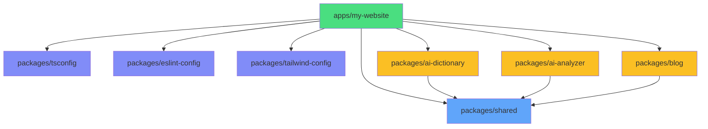
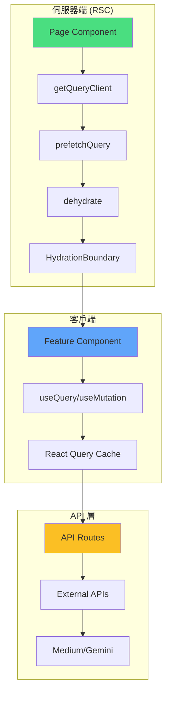
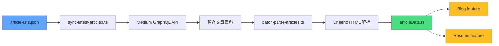
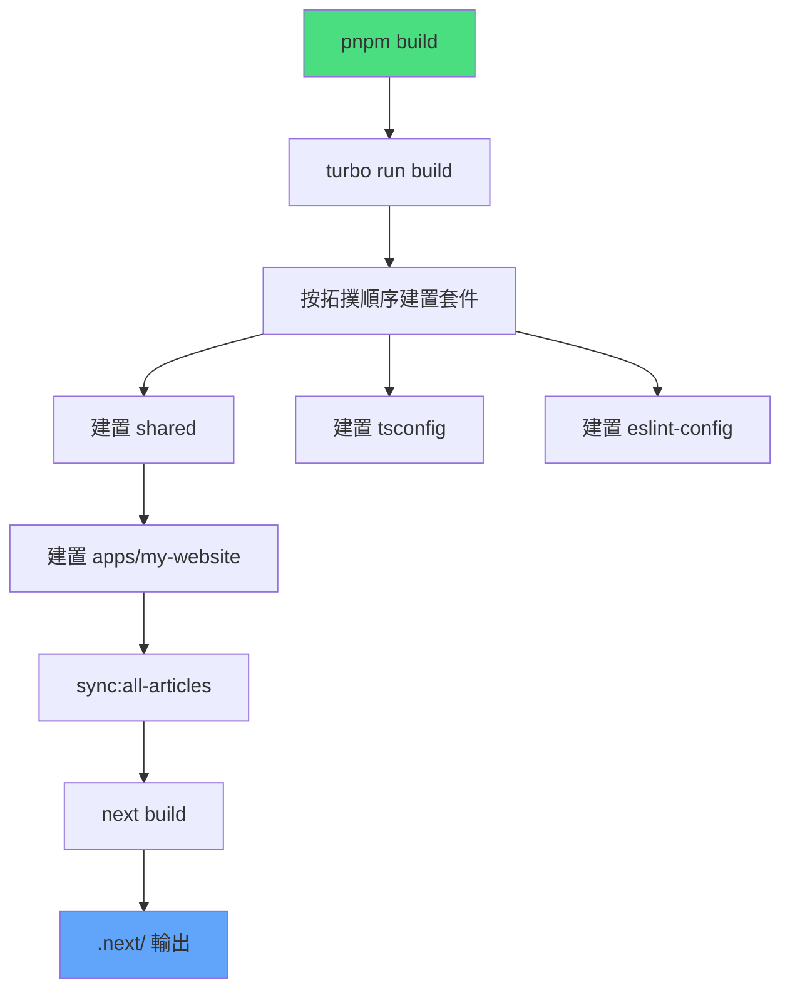
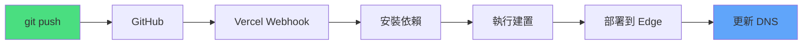
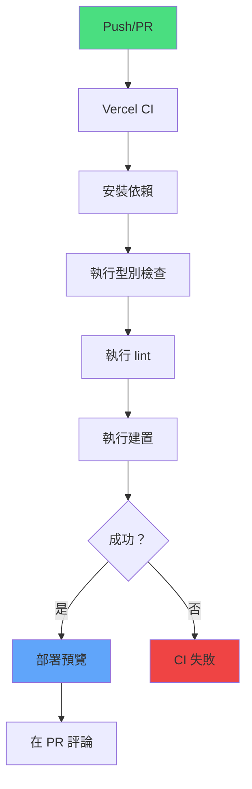
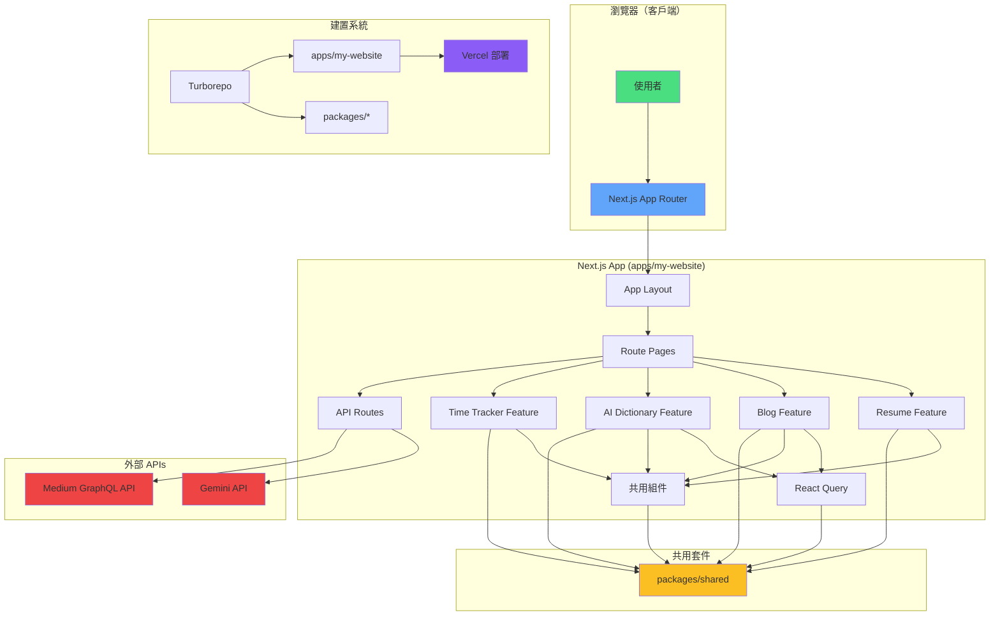
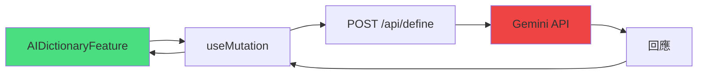
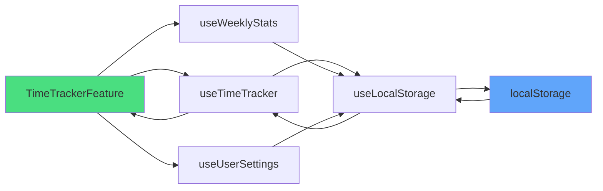

# 系統架構參考文件

## 概述

**本文件內容**：Henry Lee 個人網站（henryleelab.com）的完整系統架構，這是一個使用 TypeScript、Turborepo 和現代 React 模式構建的生產級 Next.js 15 monorepo 專案。

**架構類型**：基於功能的 monorepo，具有明確邊界，使用 Next.js App Router、React Server Components 和靜態網站生成。

**主要特性**：

- 由 Turborepo 和 pnpm workspaces 管理的 Monorepo
- 基於功能的架構，具有強制執行的邊界（ESLint）
- Next.js 15 App Router 搭配 RSC（React Server Components）
- 靜態網站生成（SSG）搭配選擇性資料預取
- React Query 用於伺服器狀態管理
- Vercel 部署，具有自動 CI/CD

**專案位置**：`/Users/henrylee/personal/my-website`

**生產環境 URL**：https://henryleelab.com

---

## 快速參考

**最常用操作：**

| 操作             | 指令                                    | 說明                                       |
| ---------------- | --------------------------------------- | ------------------------------------------ |
| 啟動開發環境     | `pnpm dev`                              | 使用 Turbo TUI 啟動開發伺服器（port 3000） |
| 建置生產版本     | `pnpm build`                            | 使用 Turborepo 快取建置所有應用程式        |
| 執行品質檢查     | `pnpm check`                            | 執行型別檢查 + lint + 格式化（自動修復）   |
| 同步 Medium 文章 | `pnpm sync:all-articles`                | 獲取並解析最新的 Medium 文章               |
| 新增功能         | 在 `apps/my-website/src/features/` 建立 | 遵循功能結構模式                           |

**專案結構快速檢視：**

```
my-website/
├── apps/
│   └── my-website/          # 主要 Next.js 15 應用程式
│       ├── src/
│       │   ├── app/         # Next.js App Router（路由）
│       │   ├── features/    # 基於功能的模組（隔離）
│       │   ├── components/  # 共用 UI 組件
│       │   ├── lib/         # 核心函式庫（React Query、logger）
│       │   └── types/       # 全域型別定義
│       └── scripts/         # 建置時腳本（Medium 同步）
├── packages/
│   ├── shared/              # 共用型別、資料、工具
│   ├── tsconfig/            # 共用 TypeScript 設定
│   └── eslint-config/       # 共用 ESLint 設定
└── docs/                    # 文件（ADRs、指南、參考）
```

---

## 技術堆疊

### 核心技術

**執行環境與框架：**

- **Next.js**：15.4.7（App Router、RSC、SSG）
- **React**：19.0.0（Server Components、hooks）
- **TypeScript**：5.9.3（strict mode）
- **Node.js**：>= 20.x

**建置與開發：**

- **Turborepo**：2.5.8（monorepo 建置編排）
- **pnpm**：9.15.4（套件管理器、workspaces）
- **Turbopack**：內建於 Next.js 15（開發模式打包器）
- **ESBuild**：透過 Next.js（生產建置）

**樣式與 UI：**

- **Tailwind CSS**：4.1.16（utility-first CSS）
- **DaisyUI**：5.4.2（組件庫）
- **Framer Motion**：12.23.24（動畫）
- **lucide-react**：0.552.0（UI 圖示）
- **react-icons**：5.5.0（品牌/公司標誌）

**狀態管理與資料：**

- **React Query**：5.81.2（伺服器狀態、快取）
- **date-fns**：4.1.0（日期處理）
- **localStorage**：原生（time-tracker 持久化）

**AI 整合：**

- **Google Gemini API**：2.5 Flash Lite（AI 字典與分析器）
- **@google/generative-ai**：0.24.1（SDK）

**日誌與監控：**

- **Pino**：10.1.0（結構化日誌）
- **@vercel/analytics**：1.5.0（網站分析）
- **@vercel/speed-insights**：1.2.0（效能追蹤）

**開發工具：**

- **ESLint**：9.39.0（linting、flat config）
- **Prettier**：3.6.2（格式化）
- **Husky**：9.1.7（git hooks）
- **lint-staged**：16.1.2（pre-commit 檢查）
- **Commitlint**：20.1.0（commit 訊息驗證）
- **tsx**：4.20.6（TypeScript 腳本執行）

**外部服務：**

- **Medium API**：GraphQL API（文章獲取）
- **Vercel**：部署平台
- **Cheerio**：1.1.2（文章的 HTML 解析）

### 版本要求

| 技術        | 版本限制  | 原因                            |
| ----------- | --------- | ------------------------------- |
| React Query | >= 5.84.1 | 修復 SSG 相容性 bug（ADR-001）  |
| Next.js     | 15.x      | App Router、RSC、Turbopack 支援 |
| React       | 19.x      | Next.js 15 必需                 |
| TypeScript  | 5.x       | Strict mode 功能                |
| pnpm        | 9.15.4+   | Workspace protocol 支援         |

---

## Monorepo 結構

### Workspace 組織

**根目錄設定：**

```json
{
  "name": "my-website-monorepo",
  "private": true,
  "packageManager": "pnpm@9.15.4",
  "workspaces": ["apps/*", "packages/*"]
}
```

**Workspace 拓撲：**

```
Root (my-website-monorepo)
├── apps/
│   └── my-website (Next.js app)
│       ├── 依賴：@packages/shared
│       ├── 依賴：@packages/tsconfig
│       ├── 依賴：@packages/eslint-config
│       ├── 依賴：@packages/tailwind-config
│       ├── 依賴：@packages/ai-dictionary
│       ├── 依賴：@packages/ai-analyzer
│       └── 依賴：@packages/blog
└── packages/
    ├── shared/           # 無依賴（基礎）
    ├── tsconfig/         # 無依賴
    ├── eslint-config/    # 無依賴
    ├── tailwind-config/  # 無依賴
    ├── ai-dictionary/    # 依賴：@packages/shared
    ├── ai-analyzer/      # 依賴：@packages/shared
    └── blog/             # 依賴：@packages/shared
```

### Apps

#### apps/my-website

**用途**：主要的 Next.js 15 應用程式，服務 henryleelab.com

**技術**：Next.js 15（App Router）、React 19、TypeScript

**結構**：

```
apps/my-website/
├── src/
│   ├── app/              # Next.js App Router（基於檔案的路由）
│   │   ├── layout.tsx    # 根 layout（providers、字體）
│   │   ├── page.tsx      # 首頁（resume 功能）
│   │   ├── blog/         # Blog 路由
│   │   ├── about/        # About 路由
│   │   ├── ai-dictionary/  # AI Dictionary 路由
│   │   ├── ai-analyzer/    # AI Analyzer 路由
│   │   ├── time-tracker/   # Time Tracker 路由
│   │   ├── api/          # API 路由
│   │   │   ├── define/       # POST - AI 單字分析
│   │   │   ├── ai-analyzer/  # POST - AI 分析
│   │   │   └── medium-articles/ # GET - 快取的文章
│   │   └── not-found.tsx # 404 頁面
│   ├── features/         # 功能模組（自包含）
│   │   ├── resume/       # 首頁/履歷功能
│   │   ├── blog/         # 部落格列表功能
│   │   ├── ai-dictionary/  # AI 字典功能
│   │   ├── ai-analyzer/    # AI 分析器功能
│   │   ├── time-tracker/   # 時間追蹤功能
│   │   ├── about/        # 關於頁面功能
│   │   └── not-found/    # 404 功能
│   ├── components/       # 共用 UI 組件
│   │   └── shared/       # 可跨功能匯入
│   ├── lib/              # 核心函式庫
│   │   ├── query-client.ts  # React Query 設定
│   │   ├── logger/          # Pino logger 設定
│   │   └── medium/          # Medium API 整合
│   ├── types/            # 全域型別定義
│   ├── constants/        # 全域常數
│   ├── utils/            # 全域工具
│   └── data/             # 靜態資料檔案
├── scripts/              # 建置時自動化
│   ├── sync-latest-articles.ts   # 獲取最新 2 篇文章
│   ├── batch-parse-articles.ts   # 解析文章內容
│   └── validate-commit-size.ts   # Git hook 驗證
├── public/               # 靜態資源
├── .next/                # Next.js 建置輸出（gitignored）
├── tailwind.config.ts    # Tailwind CSS 設定
├── tsconfig.json         # TypeScript 設定（繼承 @packages/tsconfig）
├── eslint.config.js      # ESLint 設定（繼承 @packages/eslint-config）
└── package.json          # 依賴與腳本
```

**關鍵腳本**：

```json
{
  "dev": "next dev --turbopack",
  "build": "pnpm run sync:all-articles && next build",
  "check": "tsc --noEmit && next lint --fix && prettier --write .",
  "sync:all-articles": "pnpm run sync:latest && pnpm run parse:articles"
}
```

### Packages

#### packages/shared

**用途**：跨 monorepo 的共用型別、常數、資料、工具和組件

**匯出**：

- 型別定義（文章、專案、經驗）
- 常數（URLs、設定）
- 資料檔案（articleData.ts - 自動生成）
- 工具函式（日期格式化、字串處理）
- 共用 React 組件（選用）

**使用方式**：`import { ArticleType } from '@packages/shared';`

**結構**：

```
packages/shared/
├── src/
│   ├── types/        # 共用 TypeScript interfaces
│   ├── constants/    # 共用常數
│   ├── data/         # 共用資料檔案（articleData.ts）
│   ├── utils/        # 共用工具函式
│   └── components/   # 共用 React 組件（如果有）
└── package.json
```

#### packages/tsconfig

**用途**：共用 TypeScript 設定預設

**設定檔**：

- `base.json` - 基礎設定（strict mode、ES2022）
- `nextjs.json` - Next.js 專用設定（繼承 base）
- `react-library.json` - React 函式庫設定（繼承 base）

**使用方式**：`"extends": "@packages/tsconfig/nextjs.json"`

#### packages/eslint-config

**用途**：共用 ESLint 設定與規則

**設定檔**：

- `next.js` - Next.js 應用程式設定（App Router 規則）
- `library.js` - 函式庫設定（用於 packages）

**外掛**：

- `@typescript-eslint` - TypeScript 規則
- `eslint-plugin-sonarjs` - 程式碼品質規則
- `eslint-plugin-unused-imports` - 移除未使用的匯入
- `eslint-plugin-perfectionist` - 排序/順序
- 自訂架構邊界規則

**使用方式**：`import nextConfig from '@packages/eslint-config/next';`

#### packages/tailwind-config

**用途**：共用 Tailwind CSS 設定

**功能**：

- DaisyUI 主題設定
- 自訂色彩方案
- 響應式斷點
- 排版設定

**使用方式**：`import config from '@packages/tailwind-config';`

#### packages/ai-dictionary

**用途**：AI 驅動的單字分析套件（可提取重用）

**功能**：透過 Gemini API 提供單字詞源、定義、使用範例

**結構**：基於功能（components、hooks、types）

#### packages/ai-analyzer

**用途**：通用 AI 分析套件（可提取重用）

**功能**：透過 Gemini API 進行基於提示的分析

**結構**：基於功能（components、hooks、types）

#### packages/blog

**用途**：部落格功能套件（Medium 整合）

**功能**：文章列表、無限滾動、文章顯示

**結構**：基於功能（components、hooks、queries）

### 依賴圖



**圖例：**

- 🟢 綠色：主要應用程式
- 🔵 藍色：基礎套件（無依賴）
- 🟣 紫色：設定套件
- 🟡 黃色：功能套件（依賴 shared）

---

## 基於功能的架構

### 功能隔離原則

**定義**：每個功能都是一個自包含的模組，擁有自己的組件、hooks、型別和工具。功能之間不能互相匯入（由 ESLint 強制執行）。

**優勢**：

- 高內聚（相關程式碼在一起）
- 低耦合（功能獨立）
- 易於理解（所有功能程式碼在一個地方）
- 促進程式碼重用（提取到套件）
- 改善建置效能（tree-shaking）

**強制執行**：自訂 ESLint 規則防止跨功能匯入。

### 功能結構模式

**標準功能結構：**

```
{feature-name}/
├── {FeatureName}Feature.tsx  # 主要編排組件（入口點）
├── index.ts                  # Barrel export（export { FeatureName }Feature）
├── components/               # 功能專用組件
│   ├── ComponentA/
│   │   ├── ComponentA.tsx
│   │   ├── SubComponent.tsx
│   │   ├── LoadingState.tsx
│   │   ├── ErrorState.tsx
│   │   ├── EmptyState.tsx
│   │   └── index.ts
│   └── ComponentB/
│       └── ComponentB.tsx
├── hooks/                    # 功能專用 hooks
│   ├── useFeatureData.ts
│   └── useFeatureLogic.ts
├── types/                    # 功能專用型別
│   └── feature.types.ts
├── utils/                    # 功能專用工具
│   ├── calculations.ts
│   └── formatters.ts
├── constants/                # 功能專用常數
│   └── feature.constants.ts
└── queries/                  # React Query queries（如適用）
    ├── queryKeys.ts
    ├── queryFns.ts
    └── queryConfigs.ts
```

**檔案命名慣例：**

| 型別     | 慣例                    | 範例                   |
| -------- | ----------------------- | ---------------------- |
| 功能組件 | `*Feature.tsx`          | `ResumeFeature.tsx`    |
| 頁面組件 | `page.tsx`              | `app/blog/page.tsx`    |
| UI 組件  | PascalCase              | `HeroSection.tsx`      |
| Hook     | `use` 前綴、camelCase   | `useMediumArticles.ts` |
| 型別檔案 | camelCase + `.types.ts` | `article.types.ts`     |
| 工具     | camelCase               | `formatDate.ts`        |
| 常數     | camelCase 或 UPPER_CASE | `API_PATHS.ts`         |
| 功能目錄 | kebab-case              | `time-tracker/`        |
| 組件目錄 | PascalCase              | `HeaderSection/`       |

### 架構邊界

**ESLint 強制執行規則：**

✅ **允許：**

- 功能 → `@packages/shared`（共用程式碼）
- 功能 → `@/components/shared`（共用 UI 組件）
- 功能 → `@/lib/*`（核心函式庫）
- 功能 → `@/types/*`（全域型別）
- 功能 → `@/constants/*`（全域常數）
- 功能 → `@/utils/*`（全域工具）
- 任何 → `@packages/shared/data/articleData.ts`（資料檔案）

❌ **禁止：**

- 功能 A → 功能 B（跨功能匯入）
- 功能 → `@/app/*`（路由匯入）
- 任何 → `@/features/{feature}/hooks`（功能專用 hooks）
- 任何 → `@/features/{feature}/types`（功能專用型別）
- 任何 → `@/features/{feature}/utils`（功能專用工具）

**理由**：強制執行明確邊界，防止循環依賴，使功能提取成為可能。

### 當前功能

#### resume

**位置**：`apps/my-website/src/features/resume/`

**用途**：首頁，展示個人介紹、經驗、專案和最新部落格文章

**路由**：`/`（根目錄）

**組件**：

- `ResumeFeature.tsx` - 主要編排器
- `HeroSection` - 帶頭像的介紹
- `ExperienceSection` - 工作經驗時間線
- `ProjectsSection` - 特色專案
- `RecentArticlesSection` - 最新部落格文章

**資料來源**：來自 `@packages/shared` 的靜態資料

**狀態管理**：無（靜態內容）

#### blog

**位置**：`packages/blog/`（提取為套件）

**用途**：部落格列表，整合 Medium，支援無限滾動

**路由**：`/blog`

**組件**：

- `BlogFeature.tsx` - 主要編排器
- `ArticleCard` - 單篇文章預覽
- `InfiniteArticleList` - 無限滾動容器

**資料來源**：透過 `@/lib/medium` 的 Medium API

**狀態管理**：React Query（無限查詢搭配伺服器預取）

**資料流**（ADR-001）：

```typescript
// 伺服器端預取（SEO 優化）
export default async function BlogPage() {
  const queryClient = getQueryClient();

  await queryClient.prefetchInfiniteQuery({
    queryKey: mediumArticlesKeys.list(limit),
    queryFn: ({ pageParam }) => fetchMediumArticles({ limit, pageParam }),
    pages: 1,
  });

  return (
    <HydrationBoundary state={dehydrate(queryClient)}>
      <BlogFeature />
    </HydrationBoundary>
  );
}
```

#### ai-dictionary

**位置**：`packages/ai-dictionary/`（提取為套件）

**用途**：AI 驅動的單字分析工具（詞源、定義、範例）

**路由**：`/ai-dictionary`

**組件**：

- `AIDictionaryFeature.tsx` - 主要編排器
- `WordInput` - 使用者輸入表單
- `AnalysisResult` - 顯示分析結果
- `LoadingState` - 載入動畫
- `ErrorState` - 錯誤處理

**API 端點**：`POST /api/define`

**狀態管理**：React Query（mutation、僅客戶端）

**資料流**（ADR-001）：

```typescript
// 僅客戶端 mutation（無需 SEO）
export default function AIDictionaryPage() {
  return <AIDictionaryFeature />;  // Client Component 處理 mutation
}
```

**AI 整合**：Google Gemini API（Gemini 2.5 Flash Lite）

#### ai-analyzer

**位置**：`packages/ai-analyzer/`（提取為套件）

**用途**：通用 AI 分析工具

**路由**：`/ai-analyzer`

**API 端點**：`POST /api/ai-analyzer`

**狀態管理**：React Query（mutation、僅客戶端）

**類似於 ai-dictionary 的結構**

#### time-tracker

**位置**：`apps/my-website/src/features/time-tracker/`

**用途**：時間追蹤應用程式，具有任務管理、統計和設定

**路由**：`/time-tracker`

**組件**：

- `TimeTrackerFeature.tsx` - 主要編排器
- `MainTabContent` - 活動追蹤介面
- `WeeklyStatsContent` - 每週統計檢視
- `SettingsContent` - 使用者偏好設定

**Hooks**：

- `useTimeTracker` - 主要追蹤邏輯
- `useWeeklyStats` - 統計計算
- `useUserSettings` - 設定持久化
- `useLocalStorage` - localStorage 抽象

**工具**：

- `calculations.ts` - 時間計算
- `formatters.ts` - 顯示格式化
- `validation.ts` - 輸入驗證

**持久化**：localStorage（無後端）

**狀態管理**：React hooks 搭配 localStorage 同步

#### about

**位置**：`apps/my-website/src/features/about/`

**用途**：關於頁面，包含個人資訊

**路由**：`/about`

**狀態管理**：無（靜態內容）

#### not-found

**位置**：`apps/my-website/src/features/not-found/`

**用途**：自訂 404 錯誤頁面

**路由**：N/A（顯示於未知路由）

**狀態管理**：無（靜態內容）

---

## 資料流

### 資料流模式

**模式概述：**



### React Query 架構

**設定**（`lib/query-client.ts`）：

```typescript
import { QueryClient } from "@tanstack/react-query";

// 伺服器端：每個請求建立新 client
export function getQueryClient() {
  return new QueryClient({
    defaultOptions: {
      queries: {
        staleTime: 60 * 1000, // 1 分鐘
      },
    },
  });
}

// 客戶端：建立單例 client
let clientQueryClient: QueryClient | undefined;

export function getClientQueryClient() {
  if (!clientQueryClient) {
    clientQueryClient = new QueryClient({
      defaultOptions: {
        queries: {
          staleTime: 60 * 1000,
        },
      },
    });
  }
  return clientQueryClient;
}
```

**查詢組織模式：**

```typescript
// queries/queryKeys.ts
export const mediumArticlesKeys = {
  all: ["mediumArticles"] as const,
  list: (limit: number) => [...mediumArticlesKeys.all, "list", limit] as const,
};

// queries/queryFns.ts
export async function fetchMediumArticles({
  limit,
  pageParam,
}: FetchArticlesParams) {
  const response = await fetch(
    `/api/medium-articles?limit=${limit}&cursor=${pageParam}`,
  );
  return response.json();
}

// queries/queryConfigs.ts
export const mediumArticlesQueryConfig = {
  staleTime: 5 * 60 * 1000, // 5 分鐘
  gcTime: 10 * 60 * 1000, // 10 分鐘（以前的 cacheTime）
  retry: 2,
  initialPageParam: 0,
  getNextPageParam: (lastPage) => lastPage.nextCursor,
};
```

### 模式 1：伺服器端預取（SEO 優化）

**何時使用**（ADR-001）：

- 需要 SEO 的 GET 請求
- 需要初始資料的無限查詢
- 受益於 SSG 的內容密集頁面

**實作：**

```typescript
// app/blog/page.tsx（Server Component）
import { dehydrate, HydrationBoundary } from "@tanstack/react-query";
import { getQueryClient } from "@/lib/query-client";

export default async function BlogPage() {
  const queryClient = getQueryClient();

  // 在伺服器上預取
  await queryClient.prefetchInfiniteQuery({
    queryKey: mediumArticlesKeys.list(6),
    queryFn: ({ pageParam }) => fetchMediumArticles({ limit: 6, pageParam }),
    ...mediumArticlesQueryConfig,
    pages: 1,  // 只預取第一頁
  });

  return (
    <HydrationBoundary state={dehydrate(queryClient)}>
      <BlogFeature />
    </HydrationBoundary>
  );
}
```

```typescript
// features/blog/BlogFeature.tsx（Client Component）
"use client";

export const BlogFeature = () => {
  const { data, fetchNextPage, hasNextPage, isLoading } = useInfiniteQuery({
    queryKey: mediumArticlesKeys.list(6),
    queryFn: ({ pageParam }) => fetchMediumArticles({ limit: 6, pageParam }),
    ...mediumArticlesQueryConfig,
  });

  // 資料已從伺服器預取注水
  // 客戶端可以立即顯示資料 + 獲取更多頁面
};
```

**優勢**：

- 對 SEO 友好（內容在初始 HTML 中）
- 快速的首次內容繪製（FCP）
- 漸進增強（無 JS 也能運作）

### 模式 2：僅客戶端 Mutation（無 SEO）

**何時使用**（ADR-001）：

- POST/PUT/DELETE mutations
- 動態使用者互動
- 無 SEO 要求的頁面

**實作：**

```typescript
// app/ai-dictionary/page.tsx（Server Component）
export default function AIDictionaryPage() {
  // 無預取，無 HydrationBoundary
  return <AIDictionaryFeature />;
}
```

```typescript
// features/ai-dictionary/AIDictionaryFeature.tsx（Client Component）
"use client";

export const AIDictionaryFeature = () => {
  const mutation = useMutation({
    mutationFn: async (data: WordAnalysisRequest) => {
      const response = await fetch("/api/define", {
        method: "POST",
        body: JSON.stringify(data),
      });
      return response.json();
    },
  });

  // 純客戶端互動
};
```

**優勢**：

- 更簡單的實作（無注水複雜性）
- 更快的頁面載入（無伺服器預取）
- 適合使用者操作（非內容）

### 模式決策流程圖

```
頁面是否使用 React Query？
├─ 是 → 是 GET 請求？
│        ├─ 是 → 需要 SEO？
│        │        ├─ 是 → ✅ 模式 1（伺服器預取）
│        │        └─ 否  → ❌ 模式 2（僅客戶端）
│        └─ 否（POST/PUT/DELETE）→ ❌ 模式 2（僅客戶端）
└─ 否 → 一般 Server Component（無 React Query）
```

### API Routes

**位置**：`apps/my-website/src/app/api/`

#### POST /api/define

**用途**：透過 Gemini API 進行 AI 驅動的單字分析

**處理器**：`app/api/define/route.ts`

**請求：**

```typescript
interface WordAnalysisRequest {
  word: string;
  type: "etymology" | "definition" | "usage";
}
```

**回應：**

```typescript
interface WordAnalysisResponse {
  word: string;
  analysis: string;
  timestamp: string;
}
```

**流程**：

```
客戶端 → POST /api/define → Gemini API → 回應
```

**錯誤處理**：返回 400/500 帶錯誤訊息

#### POST /api/ai-analyzer

**用途**：透過 Gemini API 進行通用 AI 分析

**處理器**：`app/api/ai-analyzer/route.ts`

**請求：**

```typescript
interface AIAnalysisRequest {
  need: string; // 分析類型
  prompt: string; // 使用者輸入
}
```

**回應：**

```typescript
interface AIAnalysisResponse {
  analysis: string;
  timestamp: string;
}
```

#### GET /api/medium-articles

**用途**：獲取快取的 Medium 文章

**處理器**：`app/api/medium-articles/route.ts`

**查詢參數：**

```typescript
interface MediumArticlesQuery {
  limit?: number; // 預設：10
  cursor?: number; // 用於分頁
}
```

**回應：**

```typescript
interface MediumArticlesResponse {
  articles: ArticleType[];
  nextCursor: number | null;
  hasMore: boolean;
}
```

**資料來源**：`@packages/shared/data/articleData.ts`（自動生成）

### Medium 文章自動化

**工作流程：**



**步驟說明：**

1. **來源**：`apps/my-website/article-urls.json`

   ```json
   {
     "articleUrls": [
       "https://medium.com/@user/article-1",
       "https://medium.com/@user/article-2"
     ]
   }
   ```

2. **腳本 1**：`scripts/sync-latest-articles.ts`
   - 從 Medium GraphQL API 獲取最新 2 篇文章
   - 提取元資料（標題、描述、發布日期）
   - 儲存到暫存 JSON 檔案

3. **腳本 2**：`scripts/batch-parse-articles.ts`
   - 讀取暫存文章資料
   - 獲取完整 HTML 內容
   - 使用 Cheerio 解析（提取正文、圖片、程式碼區塊）
   - 生成 `@packages/shared/data/articleData.ts`

4. **輸出**：`packages/shared/data/articleData.ts`

   ```typescript
   export const articles: ArticleType[] = [
     {
       id: "article-1",
       title: "文章標題",
       description: "簡短描述",
       url: "https://medium.com/@user/article-1",
       publishedAt: "2025-01-01",
       readingTime: 5,
       tags: ["tag1", "tag2"],
       content: "<解析後的 HTML 內容>",
     },
   ];
   ```

5. **使用**：Blog 和 Resume 功能匯入並顯示文章

**觸發時機：**

- **自動**：`pnpm build` 會在建置前執行 `sync:all-articles`
- **手動**：`pnpm sync:all-articles`（或 `sync:latest` + `parse:articles`）
- **開發**：使用快取的文章（無需頻繁同步）

**重要**：`articleData.ts` 是自動生成的，**請勿手動編輯**。

### localStorage 持久化（Time Tracker）

**模式：**

```typescript
// hooks/useLocalStorage.ts
export function useLocalStorage<T>(key: string, initialValue: T) {
  const [storedValue, setStoredValue] = useState<T>(() => {
    if (typeof window === "undefined") return initialValue;

    try {
      const item = window.localStorage.getItem(key);
      return item ? JSON.parse(item) : initialValue;
    } catch {
      return initialValue;
    }
  });

  const setValue = (value: T | ((val: T) => T)) => {
    try {
      const valueToStore =
        value instanceof Function ? value(storedValue) : value;
      setStoredValue(valueToStore);

      if (typeof window !== "undefined") {
        window.localStorage.setItem(key, JSON.stringify(valueToStore));
      }
    } catch (error) {
      console.error("localStorage 錯誤：", error);
    }
  };

  return [storedValue, setValue] as const;
}
```

**在 time-tracker 中使用：**

```typescript
const [tasks, setTasks] = useLocalStorage<Task[]>("timeTracker.tasks", []);
const [settings, setSettings] = useLocalStorage<Settings>(
  "timeTracker.settings",
  defaultSettings,
);
```

**持久化的資料：**

- 活動和已完成的任務
- 使用者偏好設定（工作時數、休息時間）
- 每週統計快取

**優勢**：

- 無需後端
- 即時同步
- 離線運作
- 隱私（資料保存在裝置上）

---

## 建置與部署

### Turborepo 建置系統

**設定**：`turbo.json`

```json
{
  "$schema": "https://turborepo.com/schema.json",
  "ui": "tui",
  "tasks": {
    "build": {
      "dependsOn": ["^build"],
      "outputs": [".next/**", "!.next/cache/**", "dist/**"],
      "env": ["GEMINI_API_KEY", "NODE_ENV", "NEXT_RUNTIME"]
    },
    "dev": {
      "persistent": true,
      "cache": false,
      "env": ["GEMINI_API_KEY", "NODE_ENV", "NEXT_RUNTIME"]
    },
    "lint": {
      "outputs": [],
      "env": ["NODE_ENV"]
    },
    "check-types": {},
    "check": {
      "dependsOn": ["lint", "check-types"],
      "outputs": []
    }
  }
}
```

**任務依賴：**



**建置流程：**

1. **依賴解析**：Turborepo 按拓撲順序排序套件
2. **並行建置**：獨立套件並行建置
3. **文章同步**：`sync:all-articles` 在 Next.js 建置前執行
4. **Next.js 建置**：生成靜態頁面（SSG）
5. **快取**：Turborepo 快取輸出以加速重建

**快取策略：**

| 任務          | 快取  | 原因                          |
| ------------- | ----- | ----------------------------- |
| `build`       | ✅ 是 | 基於輸入的確定性輸出          |
| `dev`         | ❌ 否 | 持久化程序，無法快取          |
| `lint`        | ✅ 是 | 確定性，快速失效              |
| `check-types` | ✅ 是 | 確定性的 TypeScript 檢查      |
| `check`       | ✅ 是 | 依賴快取的 lint + check-types |

**快取失效：**

- 原始碼變更（`src/**`）
- 設定變更（`tsconfig.json`、`eslint.config.js`）
- 依賴變更（`package.json`、`pnpm-lock.yaml`）
- 環境變數變更（在 `turbo.json` 中定義）

**遠端快取**：未設定（可透過 Vercel 或自訂快取啟用）

### Next.js 建置流程

**建置指令**：`pnpm build`（在 `apps/my-website`）

**完整建置序列：**

```bash
pnpm run sync:all-articles  # 獲取並解析 Medium 文章
→ tsx scripts/sync-latest-articles.ts
→ tsx scripts/batch-parse-articles.ts
→ 生成 packages/shared/data/articleData.ts

next build  # 建置 Next.js 應用程式
→ 編譯 TypeScript
→ 使用 Turbopack 打包（生產模式）
→ 生成靜態頁面（SSG）
→ 優化圖片
→ 建立 .next/ 輸出目錄
```

**靜態頁面生成：**

Next.js 15 會自動為所有沒有動態區段的路由生成靜態頁面：

| 路由                   | 類型       | 原因                     |
| ---------------------- | ---------- | ------------------------ |
| `/`                    | Static (○) | Resume 功能、靜態內容    |
| `/blog`                | Static (○) | 伺服器端預取搭配 SSG     |
| `/about`               | Static (○) | 靜態內容                 |
| `/time-tracker`        | Static (○) | 僅客戶端（localStorage） |
| `/ai-dictionary`       | Static (○) | 客戶端 mutation          |
| `/ai-analyzer`         | Static (○) | 客戶端 mutation          |
| `/api/define`          | Lambda (λ) | API 路由                 |
| `/api/ai-analyzer`     | Lambda (λ) | API 路由                 |
| `/api/medium-articles` | Lambda (λ) | API 路由                 |

**建置輸出：**

```
.next/
├── static/              # 靜態資源（CSS、JS、圖片）
├── server/              # 伺服器端程式碼（API 路由、RSC）
├── cache/               # 建置快取（用於增量建置）
└── standalone/          # 獨立部署（選用）
```

**建置優化：**

- **程式碼分割**：自動基於路由的分割
- **Tree shaking**：移除未使用的程式碼
- **圖片優化**：Next.js Image 組件（按需）
- **字體優化**：自動字體子集化
- **CSS 優化**：Tailwind CSS 清除

### Vercel 部署

**平台**：Vercel（https://vercel.com）

**部署 URL**：https://henryleelab.com

**部署策略**：基於 Git 的自動部署

**工作流程：**



**部署類型：**

| 分支     | 部署類型   | URL                                     |
| -------- | ---------- | --------------------------------------- |
| `main`   | Production | https://henryleelab.com                 |
| 其他分支 | Preview    | `https://<branch>-<project>.vercel.app` |

**建置設定**（由 Vercel 推斷）：

```json
{
  "buildCommand": "pnpm build",
  "outputDirectory": ".next",
  "installCommand": "pnpm install",
  "framework": "nextjs"
}
```

**環境變數**（在 Vercel 控制台設定）：

```
GEMINI_API_KEY=<secret>
NODE_ENV=production
NEXT_RUNTIME=nodejs
```

**部署流程：**

1. **觸發**：Git push 到 GitHub
2. **建置**：Vercel 執行 `pnpm build`
   - 使用 pnpm 安裝依賴
   - 執行 Medium 文章同步
   - 使用 Turborepo 建置 Next.js 應用程式
3. **部署**：上傳建置產物到 Vercel Edge Network
4. **DNS**：更新 DNS 記錄（僅生產環境）
5. **通知**：在 GitHub 中顯示部署狀態

**Edge Network：**

- **CDN**：全球內容交付網路
- **Serverless Functions**：API 路由按需執行
- **靜態檔案**：從 CDN 提供（快取標頭）
- **ISR**：增量靜態再生（如啟用）

**部署設定：**

- **框架**：Next.js
- **Node 版本**：20.x（自動偵測）
- **建置指令**：`pnpm build`（預設）
- **輸出目錄**：`.next`（預設）
- **安裝指令**：`pnpm install`（自動偵測）

**效能功能：**

- **Edge 快取**：靜態資源在 edge 位置快取
- **Brotli 壓縮**：文字資源自動壓縮
- **HTTP/2**：多路複用連接
- **智慧 CDN**：新部署時自動清除快取

---

## CI/CD 架構

### Git Hooks（Husky + lint-staged）

**設定**：`.husky/` 目錄

**已安裝的 hooks：**

#### pre-commit

**位置**：`.husky/pre-commit`

**執行：**

```bash
pnpm lint-staged  # 格式化 + lint 暫存檔案
pnpx tsx scripts/validate-commit-size.ts  # 驗證 commit 大小
```

**lint-staged 設定**（`package.json`）：

```json
{
  "lint-staged": {
    "**/*.{ts,tsx}": ["prettier --write", "eslint --fix"],
    "**/*.{json,md}": ["prettier --write"]
  }
}
```

**commit 大小驗證**：

- 每個 commit 最多 15 個檔案
- 每個 commit 最多 500 行變更
- 鼓勵聚焦、可審查的 commits

**執行時間**：1-3 秒（設計上快速）

**理由**（參見 `docs/explanation/git-hooks-research.md`）：

- Pre-commit 必須快速（< 3 秒）以避免打斷流程
- 型別檢查移至 pre-push 以提高速度
- 87% 的開發者期望 < 3 秒的 pre-commit 時間

#### commit-msg

**位置**：`.husky/commit-msg`

**執行：**

```bash
pnpx commitlint --edit "$1"
```

**commitlint 設定**（`commitlint.config.js`）：

```javascript
module.exports = {
  extends: ["@commitlint/config-conventional"],
  rules: {
    "type-enum": [
      2,
      "always",
      [
        "feat", // 新功能
        "fix", // Bug 修復
        "docs", // 文件
        "style", // 程式碼風格（格式化）
        "refactor", // 程式碼重構
        "perf", // 效能改善
        "test", // 測試
        "chore", // 維護
        "revert", // 還原 commit
        "build", // 建置系統
        "ci", // CI/CD
      ],
    ],
    "subject-case": [2, "always", "sentence-case"],
  },
};
```

**範例：**

```bash
✅ feat: add dark mode toggle to settings
✅ fix: correct layout bug on mobile devices
✅ docs: update API documentation for /define endpoint
✅ refactor: simplify time calculation logic in time-tracker
❌ Add dark mode  # 缺少類型前綴
❌ feat: Add Dark Mode  # 主旨應該是 sentence case
```

**優勢**：

- 一致的 commit 歷史
- 自動生成變更日誌
- 支援語意化版本
- 更好的 git 歷史導覽

#### pre-push

**位置**：`.husky/pre-push`

**執行：**

```bash
pnpm run check  # 型別檢查 + lint + 格式化
```

**包含：**

1. **型別檢查**：`tsc --noEmit`（完整專案）
2. **Linting**：`next lint --fix --max-warnings=0`
3. **格式化**：`prettier --write .`

**執行時間**：5-15 秒（快取：2-5 秒）

**理由**（參見 `docs/explanation/git-hooks-research.md`）：

- 分享程式碼前的全面檢查
- 捕獲 pre-commit 遺漏的型別錯誤
- Turborepo 快取使後續執行快速
- CI/CD 前的最後防線

**繞過**：`git push --no-verify`（謹慎使用）

### Git Hooks 策略總結

**理念**（基於產業研究）：

```
Pre-commit：快速格式化 + linting（< 3s）
     ↓
Commit-msg：驗證 commit 訊息格式
     ↓
Pre-push：全面檢查（型別檢查 + 完整 lint）
     ↓
CI/CD：最終品質閘門（建置 + 測試）
```

**優勢：**

- 快速的 commit 流程（87% 開發者滿意度）
- 無型別檢查誤報（快取問題）
- 團隊影響前的全面驗證
- 明確的關注點分離

**取捨：**

- 某些本地 commits 可能有型別錯誤（在 pre-push 捕獲）
- 需要紀律（不要繞過 pre-push）
- 開發者必須理解策略

**產業對齊：**

- 52% 的成功專案使用輕量級 pre-commit
- 64% 使用全面的 pre-push 驗證
- 主要專案（Next.js、React、Turborepo）遵循類似模式

**延伸閱讀**：參見 `docs/explanation/git-hooks-research.md` 了解全面的研究和理由。

### 持續整合（CI）

**平台**：GitHub Actions（透過 Vercel 整合設定）

**自動執行於：**

- Pull request 建立
- Push 到 `main` 分支
- Push 到任何分支（預覽部署）

**CI 工作流程**（Vercel 管理）：



**執行的檢查：**

1. 依賴安裝
2. 型別檢查（`tsc --noEmit`）
3. Linting（`next lint`）
4. 建置（`pnpm build`）
5. 預覽部署（如果是 PR）

**狀態檢查：**

- ✅ 所有檢查通過 → PR 可合併
- ❌ 任何檢查失敗 → PR 被阻止

**通知：**

- PR 上的 GitHub 狀態檢查
- Vercel 部署預覽評論
- 失敗時的電子郵件通知

### 持續部署（CD）

**部署觸發：**

| 事件           | 觸發          | 部署               |
| -------------- | ------------- | ------------------ |
| Push 到 `main` | 自動          | Production         |
| Push 到分支    | 自動          | Preview            |
| 手動部署       | Vercel 控制台 | Production/Preview |

**部署流程：**

1. CI 通過（所有檢查綠燈）
2. Vercel 開始部署
3. 建置完成
4. 部署到 Edge Network
5. 更新 DNS（僅生產環境）
6. 快取失效
7. 部署完成

**回滾策略：**

- Vercel 控制台：即時回滾到上一個部署
- Git revert：還原 commit，push 到 `main`
- 手動：從 Vercel 部署特定 commit

**監控：**

- Vercel Analytics（web vitals）
- Vercel Speed Insights（效能）
- Pino 日誌（伺服器端結構化日誌）

---

## 關鍵模式

### 設計模式

#### 1. 基於功能的模組化

**模式**：按功能組織程式碼（垂直切片），而非按層（水平切片）。

**結構：**

```
features/
├── blog/              # 所有 blog 相關程式碼
│   ├── components/
│   ├── hooks/
│   ├── types/
│   └── queries/
└── time-tracker/      # 所有 time-tracker 程式碼
    ├── components/
    ├── hooks/
    ├── types/
    └── utils/
```

**優勢：**

- 高內聚（相關程式碼在一起）
- 低耦合（功能獨立）
- 易於理解（所有功能程式碼在一個地方）
- 促進程式碼重用（提取到套件）
- 改善建置效能（tree-shaking）

**強制執行**：ESLint 規則防止跨功能匯入。

#### 2. Barrel Exports

**模式**：使用 `index.ts` 檔案為模組建立公開 API。

**範例：**

```typescript
// features/blog/components/ArticleCard/index.ts
export { ArticleCard } from "./ArticleCard";
export type { ArticleCardProps } from "./ArticleCard";
```

**使用方式：**

```typescript
// 乾淨的匯入
import { ArticleCard } from "@/features/blog/components/ArticleCard";

// 而不是
import { ArticleCard } from "@/features/blog/components/ArticleCard/ArticleCard";
```

**優勢：**

- 乾淨的匯入陳述
- 抽象化（隱藏內部結構）
- 易於重構（改變內部不影響匯入）

#### 3. 狀態組件模式

**模式**：在所有資料獲取組件中明確處理載入、錯誤和空狀態。

**結構：**

```typescript
const MyComponent = () => {
  const { data, isLoading, error } = useQuery(...);

  // 1. 載入狀態
  if (isLoading) return <LoadingState />;

  // 2. 錯誤狀態
  if (error) return <ErrorState error={error} />;

  // 3. 空狀態
  if (!data || data.length === 0) return <EmptyState />;

  // 4. 成功狀態（主要內容）
  return <MainContent data={data} />;
};
```

**優勢：**

- 更好的 UX（使用者知道發生什麼事）
- 防禦性程式設計（處理所有情況）
- 更容易測試（明確的狀態分支）

#### 4. React Query 組織

**模式**：將查詢鍵、函式和設定分離到專用檔案。

**結構：**

```typescript
// queries/queryKeys.ts
export const articleKeys = {
  all: ["articles"] as const,
  list: (filters: Filters) => [...articleKeys.all, "list", filters] as const,
  detail: (id: string) => [...articleKeys.all, "detail", id] as const,
};

// queries/queryFns.ts
export async function fetchArticles(filters: Filters) {
  const response = await fetch(`/api/articles?${new URLSearchParams(filters)}`);
  return response.json();
}

// queries/queryConfigs.ts
export const articlesQueryConfig = {
  staleTime: 5 * 60 * 1000,
  gcTime: 10 * 60 * 1000,
  retry: 2,
};
```

**優勢：**

- 一致的查詢鍵（無拼寫錯誤）
- 可重用的查詢函式
- 集中設定
- 更容易使查詢失效

#### 5. 路徑別名

**模式**：使用 TypeScript 路徑別名實現乾淨、可維護的匯入。

**設定**（`tsconfig.json`）：

```json
{
  "compilerOptions": {
    "baseUrl": ".",
    "paths": {
      "@/*": ["src/*"],
      "@packages/*": ["../../packages/*"]
    }
  }
}
```

**使用方式：**

```typescript
// 乾淨
import { ArticleType } from "@packages/shared";
import { BlogFeature } from "@/features/blog";

// 而不是
import { ArticleType } from "../../packages/shared";
import { BlogFeature } from "../../../features/blog";
```

**優勢：**

- 絕對匯入（無相對路徑混淆）
- 重構友好（路徑不變）
- 更乾淨的差異（無路徑變更）

### 架構模式

#### 1. Monorepo 搭配 Workspaces

**模式**：單一儲存庫包含多個套件，共用依賴。

**工具：**

- pnpm workspaces（套件管理）
- Turborepo（建置編排）

**優勢：**

- 跨套件的原子 commits
- 共用依賴（無版本衝突）
- 易於重構（跨套件變更）
- 一致的工具（ESLint、TypeScript）

#### 2. App Router 搭配 RSC

**模式**：Next.js App Router 搭配 React Server Components（預設）和 Client Components（選擇加入）。

**檔案慣例：**

```typescript
// Server Component（預設）
export default async function Page() {
  const data = await fetchData();  // 伺服器端資料獲取
  return <div>{data}</div>;
}

// Client Component（選擇加入）
'use client';
export function ClientComponent() {
  const [state, setState] = useState();  // 客戶端狀態
  return <div>{state}</div>;
}
```

**優勢：**

- Server components 零 JS（更快的頁面載入）
- 伺服器端資料獲取（無瀑布流）
- 對 SEO 友好（內容在初始 HTML 中）
- 漸進增強

#### 3. 靜態網站生成（SSG）

**模式**：在建置時為所有沒有動態區段的頁面生成靜態 HTML。

**建置輸出：**

```
Route                    Type
─────                    ────
○ /                      Static (○)
○ /blog                  Static (○)
λ /api/define            Lambda (λ)
```

**優勢：**

- 快速的頁面載入（從 CDN 提供靜態 HTML）
- 不需要伺服器（除了 API 路由）
- SEO 優化（內容在 HTML 中）
- 成本效益（更少的 serverless 調用）

#### 4. 共用套件策略

**模式**：將通用程式碼提取到共用套件以跨應用程式重用。

**何時提取：**

- 被 2 個以上功能使用的程式碼
- 無功能特定依賴的程式碼
- 工具、型別、常數
- UI 組件（如果重用）

**流程：**

1. 在 `packages/` 建立套件
2. 將程式碼移至套件
3. 更新功能中的匯入
4. 新增到 workspace 依賴

**優勢：**

- DRY（Don't Repeat Yourself）
- 單一真實來源
- 更容易測試（隔離）
- 開源的潛力

---

## 組件關係

### 高層組件圖



### 功能互動矩陣

| 功能          | 共用套件        | API Routes              | 外部 APIs | React Query        |
| ------------- | --------------- | ----------------------- | --------- | ------------------ |
| Resume        | ✅ articleData  | ❌                      | ❌        | ❌                 |
| Blog          | ✅ types、utils | ✅ /api/medium-articles | ✅ Medium | ✅ Infinite query  |
| AI Dictionary | ✅ types        | ✅ /api/define          | ✅ Gemini | ✅ Mutation        |
| AI Analyzer   | ✅ types        | ✅ /api/ai-analyzer     | ✅ Gemini | ✅ Mutation        |
| Time Tracker  | ✅ types、utils | ❌                      | ❌        | ❌（localStorage） |
| About         | ✅ types        | ❌                      | ❌        | ❌                 |
| Not Found     | ❌              | ❌                      | ❌        | ❌                 |

### 按功能的資料流

#### Resume Feature

```mermaid
graph LR
    A[ResumeFeature] --> B[HeroSection]
    A --> C[ExperienceSection]
    A --> D[ProjectsSection]
    A --> E[RecentArticlesSection]
    E --> F[@packages/shared/data/articleData]

    style A fill:#4ade80
    style F fill:#60a5fa
```

**資料來源**：從 `@packages/shared` 靜態匯入

**狀態**：無（靜態內容）

#### Blog Feature

```mermaid
graph LR
    A[BlogPage Server] --> B[prefetchInfiniteQuery]
    B --> C[dehydrate]
    C --> D[HydrationBoundary]
    D --> E[BlogFeature Client]
    E --> F[useInfiniteQuery]
    F --> G[/api/medium-articles]
    G --> H[articleData.ts]

    style A fill:#4ade80
    style E fill:#60a5fa
    style H fill:#fbbf24
```

**資料來源**：透過 API 路由的 Medium 文章

**狀態**：React Query（無限查詢搭配伺服器預取）

#### AI Dictionary Feature



**資料來源**：透過 API 路由的 Gemini API

**狀態**：React Query（mutation、僅客戶端）

#### Time Tracker Feature



**資料來源**：瀏覽器 localStorage

**狀態**：React hooks 搭配 localStorage 持久化

---

## 效能考量

### 建置效能

**Turborepo 快取：**

- **首次建置**：60-120 秒（無快取）
- **快取建置**：5-15 秒（無變更）
- **部分快取**：20-40 秒（某些變更）

**優化策略：**

1. **拓撲建置**：套件按依賴順序建置
2. **並行執行**：獨立套件並行建置
3. **增量建置**：只重建變更的套件
4. **輸出快取**：重用之前的建置輸出

**快取失效觸發：**

- 原始碼變更
- 設定變更
- 依賴變更
- 環境變數變更

### 開發效能

**Turbopack（開發模式）：**

- **冷啟動**：2-5 秒
- **熱重載**：50-200ms
- **完整頁面重新整理**：300-500ms

**功能：**

- 增量編譯（基於 Rust）
- 優化的模組解析
- Fast Refresh（React Server Components）
- 內建於 Next.js 15（`next dev --turbopack`）

### 執行時效能

**Core Web Vitals 目標：**

| 指標                                | 目標    | 當前（典型） |
| ----------------------------------- | ------- | ------------ |
| **LCP**（Largest Contentful Paint） | < 2.5s  | ~1.8s        |
| **FID**（First Input Delay）        | < 100ms | ~50ms        |
| **CLS**（Cumulative Layout Shift）  | < 0.1   | ~0.05        |
| **FCP**（First Contentful Paint）   | < 1.8s  | ~1.2s        |
| **TTFB**（Time to First Byte）      | < 600ms | ~300ms       |

**優化技術：**

1. **靜態生成**：頁面在建置時預渲染（SSG）
2. **圖片優化**：Next.js Image 組件（WebP、延遲載入）
3. **字體優化**：自動字體子集化和預載入
4. **程式碼分割**：基於路由的自動分割
5. **React Query 快取**：減少不必要的 API 呼叫
6. **Vercel Edge Network**：全球 CDN 搭配 edge 快取

**打包大小優化：**

- **Tree shaking**：移除未使用的程式碼
- **Tailwind CSS 清除**：移除未使用的樣式
- **動態匯入**：按需載入程式碼
- **React Query**：只包含使用的功能

**監控：**

- **Vercel Analytics**：真實使用者監控（RUM）
- **Vercel Speed Insights**：Core Web Vitals 追蹤
- **Pino 日誌**：伺服器端效能日誌

### 查詢效能

**React Query 優化：**

1. **Stale time**：防止不必要的重新獲取

   ```typescript
   staleTime: 5 * 60 * 1000,  // 5 分鐘
   ```

2. **垃圾回收**：清理未使用的快取資料

   ```typescript
   gcTime: 10 * 60 * 1000,  // 10 分鐘
   ```

3. **重試策略**：減少失敗請求開銷

   ```typescript
   retry: 2,  // 重試失敗的請求兩次
   ```

4. **預取**：減少感知載入時間

   ```typescript
   await queryClient.prefetchInfiniteQuery({ ... });
   ```

5. **分頁**：增量載入資料
   ```typescript
   useInfiniteQuery({
     getNextPageParam: (lastPage) => lastPage.nextCursor,
   });
   ```

**API 路由優化：**

1. **快取**：在可能時返回快取資料
2. **錯誤處理**：快速失敗路徑
3. **回應串流**：串流大型回應
4. **Edge Functions**：在靠近使用者的地方執行（如需要）

### 建置大小分析

**典型建置大小：**

| 資源            | 大小（gzipped） | 類型           |
| --------------- | --------------- | -------------- |
| Main JavaScript | ~80-100 KB      | 必要執行環境   |
| Page bundles    | 每個 ~20-40 KB  | 路由專用程式碼 |
| CSS (Tailwind)  | ~15-20 KB       | 清除的工具類別 |
| React + Next.js | ~120 KB         | 框架執行環境   |
| React Query     | ~12 KB          | 狀態管理       |
| 總計（初始）    | ~200-250 KB     | 首次頁面載入   |

**優化指南：**

- 保持頁面包 < 50 KB
- 總初始包 < 300 KB
- 對重型功能使用動態匯入
- 使用 Vercel Analytics 監控

---

## 設定檔案

### 根層級

#### package.json

```json
{
  "name": "my-website-monorepo",
  "private": true,
  "packageManager": "pnpm@9.15.4",
  "workspaces": ["apps/*", "packages/*"],
  "scripts": {
    "dev": "turbo run dev --ui=tui",
    "build": "turbo run build",
    "check": "turbo run check"
  }
}
```

#### turbo.json

```json
{
  "$schema": "https://turborepo.com/schema.json",
  "ui": "tui",
  "tasks": {
    "build": {
      "dependsOn": ["^build"],
      "outputs": [".next/**", "!.next/cache/**"]
    }
  }
}
```

#### .gitignore

```
node_modules/
.next/
.turbo/
dist/
.env*.local
pnpm-lock.yaml
```

### App 層級（apps/my-website）

#### tsconfig.json

```json
{
  "extends": "@packages/tsconfig/nextjs.json",
  "compilerOptions": {
    "baseUrl": ".",
    "paths": {
      "@/*": ["src/*"]
    }
  }
}
```

#### next.config.ts

```typescript
import type { NextConfig } from "next";

const nextConfig: NextConfig = {
  reactStrictMode: true,
  images: {
    domains: ["medium.com", "cdn-images-1.medium.com"],
  },
  experimental: {
    turbo: {
      enabled: true,
    },
  },
};

export default nextConfig;
```

#### eslint.config.js

```javascript
import nextConfig from "@packages/eslint-config/next";

export default [
  ...nextConfig,
  {
    // 應用程式專用規則
  },
];
```

#### tailwind.config.ts

```typescript
import type { Config } from "tailwindcss";
import sharedConfig from "@packages/tailwind-config";

const config: Config = {
  ...sharedConfig,
  content: ["./src/**/*.{ts,tsx}"],
};

export default config;
```

---

## 環境變數

### 必要變數

#### 開發環境（.env.local）

```bash
# AI 整合（AI 功能必需）
GEMINI_API_KEY=your_api_key_here

# 環境
NODE_ENV=development

# Next.js 執行環境（選用）
NEXT_RUNTIME=nodejs
```

#### 生產環境（Vercel 環境變數）

```bash
# AI 整合（必需）
GEMINI_API_KEY=<secret>

# 環境（由 Vercel 自動設定）
NODE_ENV=production
VERCEL=1
VERCEL_ENV=production
VERCEL_URL=henryleelab.com

# Next.js 執行環境（選用）
NEXT_RUNTIME=nodejs
```

### 環境變數載入

**Next.js 環境變數載入順序：**

1. `.env.local`（本地覆蓋，gitignored）
2. `.env.development`（開發專用，已提交）
3. `.env.production`（生產專用，已提交）
4. `.env`（預設，已提交）
5. Vercel 環境變數（僅生產環境）

**在程式碼中存取：**

```typescript
// 伺服器端（API 路由、Server Components）
const apiKey = process.env.GEMINI_API_KEY;

// 客戶端（需要 NEXT_PUBLIC_ 前綴）
const publicUrl = process.env.NEXT_PUBLIC_API_URL;
```

**安全注意事項：**

- 永遠不要提交 `.env.local`（包含機密）
- 永遠不要對機密使用 `NEXT_PUBLIC_` 前綴
- 伺服器端環境變數不會暴露給瀏覽器
- Vercel 會加密環境變數

---

## 相容性

### 瀏覽器支援

**支援的瀏覽器：**

- Chrome/Edge：最近 2 個版本
- Firefox：最近 2 個版本
- Safari：最近 2 個版本
- iOS Safari：最近 2 個版本
- Android Chrome：最近 2 個版本

**Polyfills**：不需要（僅現代瀏覽器）

**漸進增強**：核心功能在沒有 JavaScript 的情況下運作（對於靜態頁面）

### Node.js 支援

**必要的 Node 版本**：>= 20.x

**原因**：Next.js 15 需要 Node 20+

**套件管理器**：pnpm 9.15.4（鎖定）

### 裝置支援

**響應式斷點**（Tailwind）：

```typescript
{
  sm: '640px',   // 手機橫向
  md: '768px',   // 平板直向
  lg: '1024px',  // 平板橫向
  xl: '1280px',  // 桌面
  '2xl': '1536px'  // 大型桌面
}
```

**行動優先設計**：所有功能響應式

**觸控優化**：觸控友好的 UI 組件

---

## 另見

### 指南

- [Git 工作流程設定指南](../guides/git-workflow-setup.md) - 設定 git hooks 和 commitlint
- [開發工作流程指南](../guides/development-workflow.md) - 日常開發流程
- [部署指南](../guides/deployment.md) - 部署到 Vercel

### 說明

- [基於功能的架構說明](../explanation/feature-based-architecture.md) - 為何選擇基於功能的設計
- [Monorepo 策略說明](../explanation/monorepo-strategy.md) - Monorepo 的優勢與取捨
- [Git Hooks 研究](../explanation/git-hooks-research.md) - 關於 git hooks 的產業研究

### ADRs

- [ADR-001：React Query SSG 模式](../adr/001-react-query-ssg-pattern.md) - 伺服器預取 vs 僅客戶端
- [ADR-002：AGENTS.md 採用](../adr/002-agents-md-adoption.md) - AI 設定標準
- [ADR-003：Git Hooks 優化](../adr/003-git-hooks-optimization.md) - Pre-commit vs pre-push 策略

### 外部文件

- [Next.js 15 文件](https://nextjs.org/docs) - 官方 Next.js 文件
- [Turborepo 文件](https://turbo.build/repo/docs) - Monorepo 建置系統
- [React Query 文件](https://tanstack.com/query/latest) - 伺服器狀態管理
- [Vercel 文件](https://vercel.com/docs) - 部署平台

---

## 變更日誌

### Version 1.0.0（2025-11-07）

**初始版本**：

- 完整的架構文件
- 技術堆疊參考
- Monorepo 結構說明
- 基於功能的架構細節
- 資料流模式
- 建置與部署架構
- CI/CD 設定
- 效能考量
- 組件關係

**基於**：

- AGENTS.md（專案概述）
- CLAUDE.md（額外模式）
- ADR-001（React Query 模式）
- ADR-002（文件架構）
- Git hooks 研究（CI/CD 策略）
